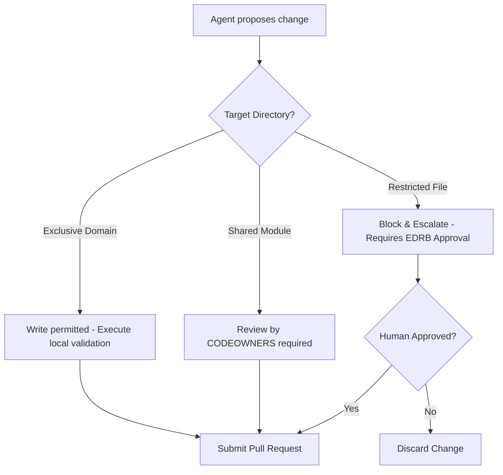

# Agent Ownership & Operating Boundaries Matrix

To enable multiple autonomous engineering agents to work in parallel on the Conductor codebase without conflicting or violating modular boundaries, we establish this mandatory operating ownership matrix.

---

## 1. Operating Permissions Classification

*   **Exclusive Ownership (E):** The agent assigned to this domain has write permissions. Other agents are blocked from modifying this directory.
*   **Shared Ownership (S):** Multiple agents can edit files in this directory. Require pull request reviews from domain owners.
*   **Restricted Access (R):** Write access is blocked by default. Any change requires manual EDRB review and human approval.
*   **Read-Only Access (RO):** All agents have read-only access to all files in the repository for reference and call-graph tracing.

---

## 2. Directory Access Matrix

| Code Module / Directory Path | Responsible Agent | Write Permission | Restricted Files |
| :--- | :--- | :--- | :--- |
| `platform/tenant/` / `com.conductor.tenant` | Tenant & Onboarding Agent | Exclusive | Database schema files |
| `platform/identity/` / `com.conductor.identity` | Security & IAM Agent | Exclusive | Keycloak configurations, realm rules |
| `platform/customer/` / `com.conductor.customer` | Customer Registry Agent | Exclusive | Consent engine algorithms |
| `platform/workflow/` / `com.conductor.workflow` | Workflow Runtime Agent | Exclusive | Custom DSL parser |
| `platform/messaging/` / `com.conductor.messaging` | Messaging Channel Agent | Exclusive | Webhook endpoints, Meta API client |
| `platform/integration/` / `com.conductor.integration` | Integration Framework Agent | Exclusive | Squid proxy routes configuration |
| `platform/analytics/` / `com.conductor.analytics` | Analytics & BI Agent | Exclusive | Metabase JWT signing keys |
| `platform/audit/` / `com.conductor.audit` | Security & Audit Agent | Exclusive | Trigger definitions, partitioning SQLs |
| `platform/common/` / `com.conductor.common` | Core Framework Team | Shared | All files |
| `config/` | System Operators | Restricted | `docker-compose.local.yml`, environments settings |
| `docs/` | Technical Writer / All | Shared | ADR approvals status |
| `infra/` / `infrastructure/` | DevOps Agent | Exclusive | Terraform states, Kubernetes configurations |

---

## 3. Conflict Resolution Workflow

---

## 4. Agent Operational Rules

1.  **Read Before Write:** Agents must call static graph analyzers or view references in `platform/common/` before writing custom wrapper logic.
2.  **No Cross-Boundary Imports:** ArchUnit test suites in Java will fail compilation if an agent attempts to import classes from an exclusive directory belonging to another domain (e.g. `com.conductor.workflow` importing `com.conductor.customer` classes directly).
3.  **Local Sandboxing:** Agents must run testing cycles in isolated container scopes using test container plugins without altering the global database settings.
