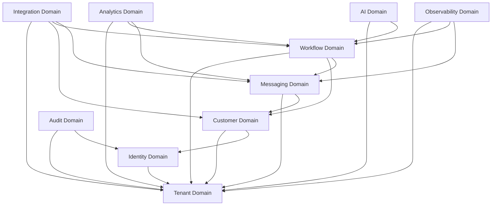

# Conductor Domain Boundaries & Bounded Contexts

This document defines the logical boundaries, responsibilities, inter-domain interactions, and engineering ownership constraints for the 10 core domains of the Conductor Platform.

---

## Bounded Context Topology

---

## 1. Tenant Domain
*   **Purpose:** Core platform foundation and multi-tenancy registry.
*   **Owned Data:** Tenant registration tables, subscription state caches (Razorpay), feature flag toggles.
*   **Owned APIs:** `POST/GET /api/v1/tenants`, `/api/v1/tenants/{id}/settings`.
*   **Owned Events:** `conductor.tenant.provisioned`, `conductor.tenant.deactivated`.
*   **Allowed Consumers:** All services (reads context headers).
*   **Forbidden Consumers:** No service may directly execute write/update queries on Tenant database tables.

---

## 2. Identity Domain
*   **Purpose:** User session security, identity federation, and role-based permissions.
*   **Owned Data:** User profiles, permissions mappings, hashed API key secrets.
*   **Owned APIs:** `POST /api/v1/auth/login`, `POST /api/v1/api-keys`.
*   **Owned Events:** `conductor.identity.user_login`, `conductor.identity.api_key_created`.
*   **Allowed Consumers:** Gateway, any service checking Spring Security contexts.
*   **Forbidden Consumers:** External messaging or webhook adapters cannot modify permissions mappings.

---

## 3. Customer Domain
*   **Purpose:** Contact registry management, contact lists segmentation, and DPDP consent controls.
*   **Owned Data:** Contacts table, lists/segments registry, append-only contact consent logs (`consent_records`).
*   **Owned APIs:** `/api/v1/customers`, `/api/v1/consent/log`.
*   **Owned Events:** `conductor.customer.opt_out`, `conductor.customer.profile_updated`.
*   **Allowed Consumers:** Workflow (verifies variables), Messaging (checks opt-out filters), Integration (imports contacts).
*   **Forbidden Consumers:** AI engines (cannot query or store customer records directly; must route via customer APIs with OIDC validated sessions).

---

## 4. Workflow Domain
*   **Purpose:** DSL parsing and execution state machine (orchestration).
*   **Owned Data:** Workflow DSL schemas, active execution paths, sleep scheduling timers.
*   **Owned APIs:** `/api/v1/workflows`, `/api/v1/workflows/executions`.
*   **Owned Events:** `conductor.workflow.started`, `conductor.workflow.step_executed`, `conductor.workflow.completed`, `conductor.workflow.failed`.
*   **Allowed Consumers:** Integration (webhook triggers), Messaging (dispatching events).
*   **Forbidden Consumers:** Direct database alterations of workflow configurations from other services (must use official workflow APIs).

---

## 5. Messaging Domain
*   **Purpose:** Outbound communications broker (Meta WhatsApp API) and webhook payload ingestion.
*   **Owned Data:** Message logs, Meta template sync states, WhatsApp Webhook history.
*   **Owned APIs:** `/api/v1/messages/send`, Webhook listener (`POST /api/v1/webhooks/whatsapp`).
*   **Owned Events:** `conductor.messaging.webhook_received`, `conductor.messaging.dispatched`, `conductor.messaging.status_updated` (`sent`/`delivered`/`read`/`failed`).
*   **Allowed Consumers:** Workflow (sending messages).
*   **Forbidden Consumers:** Direct writes to database tables from other business modules.

---

## 6. Integration Domain
*   **Purpose:** External CRM (Zoho) and eCommerce (Shopify) synchronization adapters and webhook translations.
*   **Owned Data:** Integration credentials (encrypted), synchronization jobs schedules, webhook logs.
*   **Owned APIs:** `/api/v1/integrations`, vendor-specific Webhook target paths.
*   **Owned Events:** `conductor.integration.ingress_event`, `conductor.integration.synced`.
*   **Allowed Consumers:** Workflow (injects CRM details).
*   **Forbidden Consumers:** Un-proxied outbound HTTP routing (all egress must route via Squid Forward Proxy).

---

## 7. Analytics Domain
*   **Purpose:** Telemetry aggregations and embedded reporting portals.
*   **Owned Data:** Denormalized read-only reports tables, CTR statistics.
*   **Owned APIs:** `/api/v1/analytics/embed-url` (JWT iframe generator).
*   **Owned Events:** None (data consumption context).
*   **Allowed Consumers:** React Client SPA dashboard.
*   **Forbidden Consumers:** Dynamic transactional workflow routines.

---

## 8. AI Domain
*   **Purpose:** LLM integrations, conversational copilot, and vector RAG contextual search.
*   **Owned Data:** System prompt libraries, agent memory paths, Qdrant semantic vectors indexes.
*   **Owned APIs:** `/api/v1/ai/chat`, `/api/v1/ai/vectorize`.
*   **Owned Events:** `conductor.ai.query_processed`.
*   **Allowed Consumers:** Workflow (processing text-based steps), Dashboard Client (Copilot support).
*   **Forbidden Consumers:** Transactional billing or core customer permission configurations.

---

## 9. Audit Domain
*   **Purpose:** Immutable rows configuration trigger-auditing for regulatory compliance.
*   **Owned Data:** Central `audit_logs` partitioned rows.
*   **Owned APIs:** `/api/v1/audit-logs` (read-only for administrators).
*   **Owned Events:** `conductor.audit.violation_detected`.
*   **Allowed Consumers:** System Security Officers.
*   **Forbidden Consumers:** All services are forbidden from executing `UPDATE` or `DELETE` statements on audit database records.

---

## 10. Observability Domain
*   **Purpose:** OpenTelemetry collectors, system health monitoring, and Grafana dashboard engines.
*   **Owned Data:** Prometheus telemetry metrics, Loki console logs, Tempo span traces.
*   **Owned APIs:** `/metrics` scraper metrics, `/healthz` endpoints.
*   **Owned Events:** None.
*   **Allowed Consumers:** Prometheus, Loki, Tempo, Grafana.
*   **Forbidden Consumers:** Business application modules (they should not read logs or metrics directly).

---

## Domain Interaction Rules (Consistency Matrix)

1.  **Strict Database Separation:** No database transaction may span multiple domain boundary tables unless executed as an asynchronous event handler or explicitly through OTel-traced API boundaries.
2.  **Strict Event Boundaries:** Data modifications in a foreign domain should be requested by publishing an event (e.g. Messaging publishes webhook callback status, which Customer catches to update consent logs).
3.  **Strict Context Injection:** Every inter-service HTTP or gRPC call must propagate the OIDC JWT token and `X-Tenant-ID` context parameters.
