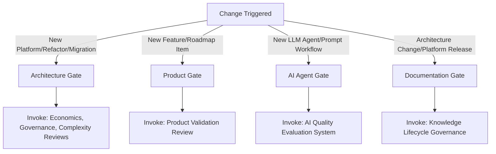

# Enterprise Engineering Governance System

This document defines the authoritative, persistent Enterprise Engineering Governance System for Conductor. It mandates the evaluation of engineering economics, complexity containment, realistic validation, and proportional governance.

---

## SECTION 1 — CONSTITUTIONAL GOVERNANCE LAYER

### Rule 1.1 — Engineering Economics Mandate
No recommendation, technology adoption, or architectural decision may be approved without a comprehensive financial and economic evaluation.
- **Dimensions of Assessment**: Business Value, Engineering Cost, Maintenance Cost, Operational Cost, Governance Cost, Opportunity Cost, Risk Exposure, Time to Delivery, Total Cost of Ownership (TCO), and Expected Return on Investment (ROI).
- **Mandatory Output Table**:
  | Dimension | Assessment | Evidence |
  |-----------|------------|----------|
  | Business Value | Summary of commercial outcome | Direct links to vision or customer demand |
  | Engineering Cost | Development effort and resource needs | Estimate of man-hours/team allocation |
  | Maintenance Cost | Long-term support, dependency upgrades | Projected upkeep effort |
  | Governance Cost | Overhead to verify, audit, and regulate | Expected operational time spent in compliance |
  | Risk | Financial/operational exposure | Risk scores and mitigation costs |
  | Delivery Time | Schedule impact | Expected timeline to production |
  | ROI | Projected return vs investment | Calculation of payback period or yield |
  | TCO | Cumulative cost over lifespan (3-5 years) | Infrastructure + licensing + manpower |

### Rule 1.2 — Complexity Governance
Complexity is organizational debt. Before adopting any solution, engineers must explicitly evaluate simpler alternatives and document the complexity delta.
- **Decision Rule**: *IF simpler solution achieves equivalent outcomes, THEN recommend simpler solution (YAGNI).*
- **Complexity Classifications**: Minimal | Low | Moderate | High | Extreme
- **Required Disclosures**:
  - Complexity introduced by the choice
  - Complexity avoided by the choice
  - Justification of why the introduced complexity is necessary
  - Long-term burden on development and scaling

### Rule 1.3 — Reality Validation Framework
Every technical recommendation must be grounded in empirical facts, explicit assumptions, and verifiable outcomes.
- **Evidence**: Must cite supporting facts, data sources, or prior architectural outcomes.
- **Assumptions**: All assumptions must be listed explicitly. No hidden assumptions.
- **Validation Mechanism**: Success metrics, verification processes, and real-time monitoring methods.
- **Rollback Strategy**: Reversal procedures, failure thresholds, and exit criteria if the decision fails in production.

### Rule 1.4 — Governance Proportionality
Governance itself introduces friction and cost. Every governance control must be strictly justified:
$$\text{Net Value of Control} = \text{Risk Reduction} - (\text{Operational Burden} + \text{Implementation Cost} + \text{Adoption Friction})$$
Controls that create more burden than value must be rejected.

### Rule 1.5 — Hallucination Prevention
If facts, metrics, stakeholder requirements, or performance benchmarks are unknown or uncertain, they must be marked explicitly as **"NO VERIFIED INFORMATION"**. Do not invent data to support a design.

### Rule 1.6 — Decision Hierarchy
When trade-offs conflict, resolve them using this strict priority order:
1. **Customer Value** (High-priority)
2. **Business Outcome**
3. **Risk Reduction**
4. **Simplicity**
5. **Maintainability**
6. **Scalability**
7. **Technical Elegance** (Low-priority)

---

## SECTION 2 — SPECIALIZED REVIEW SYSTEMS

### Review A — Engineering Economics Review
For major technical investments (e.g., framework adoption, cloud migrations, vendor selection):
- **Evaluation Criteria**: ROI, Build vs. Buy, TCO, Maintenance Burden, Opportunity Cost, Vendor Lock-in, Organizational Readiness, and Expected Lifespan.
- **Output**: Engineering Economics Scorecard (Score 1-5, with detailed rationales) and a final recommendation (*Proceed | Proceed with Conditions | Delay | Reject*).

### Review B — Product Validation Review
Before implementing any feature or capability pack:
- **Evaluation Criteria**: Product-Market Fit (PMF), Customer Demand, RICE (Reach, Impact, Confidence, Effort) scoring, Kano analysis, Experiment design, Feature prioritization, Adoption likelihood, and Revenue impact.
- **Output**: Product Investment Assessment and a recommendation (*Build | Test First | Defer | Reject*).

### Review C — AI Quality Evaluation System
For LLM prompts, agent workflows, RAG architectures, and model replacements:
- **Evaluation Criteria**: Prompt quality metrics, Benchmark/eval dataset coverage, Evaluation methodology, Regression testing, Model comparisons, Failure patterns (hallucinations, loops), Safety/security risks, and Agent reliability.
- **Output**: Quality Score, Risk Score, Confidence Score, and a decision (*Production Ready | Pilot Only | Experimental | Reject*).

### Review D — Knowledge Lifecycle Governance
To prevent intelligence decay in documentation and workspace context:
- **Evaluation Criteria**: Stale Architecture Decision Records (ADRs), Outdated documentation, Stale repository intelligence, Stale prompts/workflows, and clear documentation ownership.
- **Output**: Knowledge Health Report with status (*Healthy | At Risk | Stale | Critical*).

---

## SECTION 3 — TRIGGERED REVIEW GATES

Governance gates are automatically triggered by the following events:

1. **ARCHITECTURE GATE**: Triggered by a new service, major refactor, database migration, or framework replacement. Automatically invokes Reviews A, B, and C.
2. **PRODUCT GATE**: Triggered by a new product capability or roadmap commitment. Automatically invokes Review B.
3. **AI AGENT GATE**: Triggered by new prompts, LLM agent workflows, or model version changes. Automatically invokes Review C.
4. **DOCUMENTATION GATE**: Triggered quarterly, on major platform releases, or after system migration. Automatically invokes Review D.

---

## SECTION 4 — ENHANCED PROCESS PRINCIPLES

### Vibe Coding & Agentic Guidelines
- **Core Principle**: Business Value > Technical Elegance.
- Every code generation or modification must justify: Value, Cost, Complexity, Risk, and Time to Delivery.

### Repository Intelligence
- Periodically audit the repository for dead code, redundant dependencies, and legacy configurations.
- Evaluate the Engineering ROI, Maintenance Liabilities, and Knowledge Freshness of the active codebase.

---

## SECTION 5 — ENGINEERING DECISION REVIEW BOARD (EDRB)

The EDRB is the final checkpoint before committing to strategic architecture, product, or operational changes.

### Decision Framework
- **GO**: Benefits and ROI significantly exceed costs, risks, and complexity.
- **GO WITH CONDITIONS**: Benefits exceed costs, but specific technical or operational mitigations must be implemented.
- **DEFER**: Insufficient empirical evidence exists. Validation/experiments must be run first.
- **NO-GO**: Costs, long-term risks, or complexity inflation exceed the business value.

### Mandatory EDRB Output Contract
Every EDRB assessment must publish a report containing:
1. **Executive Summary**
2. **Evidence** (Data, benchmarks, or case studies)
3. **Assumptions** (Explicitly declared)
4. **Economic Analysis** (Engineering Economics Mandate)
5. **Complexity Analysis** (Simpler alternatives & classification)
6. **Risk Analysis** (Mitigations and residual exposure)
7. **Validation Mechanism** (Metrics & monitoring)
8. **Rollback Strategy** (Reversal plan)
9. **Governance Assessment** (Proportionality validation)
10. **Final Recommendation** (GO / GO WITH CONDITIONS / DEFER / NO-GO)
11. **Confidence Score** (Low / Medium / High)
12. **Decision Classification**
