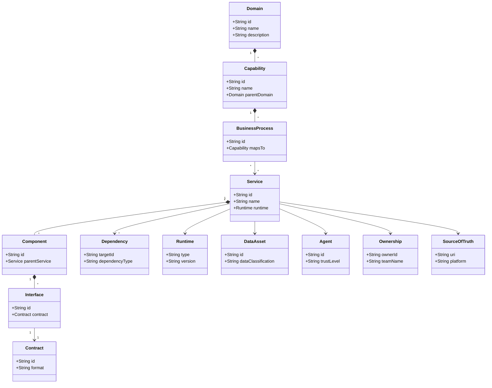

# AI-EOS Architecture Meta-Model

## Document Metadata
* **id:** EOS-04-ARCH-MM
* **title:** AI-EOS Architecture Meta-Model
* **description:** Defines the core architectural primitives and schemas governing Conductor systems.
* **owner:** Chief Architect
* **domain:** Enterprise Architecture
* **tags:** [architecture, meta-model, primitives, schema]
* **version:** 1.0.0
* **status:** Approved
* **created:** 2026-06-24T16:36:00Z
* **updated:** 2026-06-24T16:36:00Z
* **related_artifacts:** [01-constitution.md, 19-traceability-framework.md]
* **source_of_truth:** Git Repository
* **authority_level:** L2 - Governance
* **risk_tier:** Tier 3 — High
* **compliance_tags:** [ISO-27001-A.12, SOC2-CC6.1]
* **quality_score:** 1.00

---

## Purpose
This meta-model defines the formal vocabulary and schemas for modeling system assets, workflows, services, and agents. Every architectural artifact, repository definition, or configuration schema in Conductor must strictly utilize these primitives.

---

## Architectural Primitives

### 1. Domain
* **Definition:** A distinct business or operational area (e.g., Messaging, Workflows, Billing).
* **Schema:** `id` (slug), `name` (string), `description` (string), `owner` (Ownership).

### 2. Capability
* **Definition:** A business-level function enabled by the system (e.g., Opt-In Verification, Marketing Outbound).
* **Schema:** `id` (slug), `name` (string), `parent_domain` (Domain ID).

### 3. Business Process
* **Definition:** A sequence of steps or workflows that implements a Capability (e.g., Temporal workflow definitions).
* **Schema:** `id` (slug), `description` (string), `capabilities` (list of Capability IDs), `trigger` (string).

### 4. Service
* **Definition:** An independently deployable unit of execution (e.g., `conversation-service`, `billing-service`).
* **Schema:** `id` (slug), `name` (string), `runtime` (Runtime), `contracts` (list of Contract IDs), `ownership` (Ownership).

### 5. Component
* **Definition:** A modular block within a Service (e.g., Database wrapper, WhatsApp API connector).
* **Schema:** `id` (slug), `name` (string), `parent_service` (Service ID).

### 6. Contract
* **Definition:** A machine-readable, schema-enforced interface agreement (e.g., OpenAPI YAML file, AsyncAPI JSON).
* **Schema:** `id` (slug), `type` (OpenAPI | AsyncAPI | Protobuf | DB-Schema), `path` (file URI), `version` (semantic version).

### 7. Interface
* **Definition:** The exposed endpoint/channel implementing a Contract (e.g., REST `/v1/send-message`, NATS channel `message.outbound`).
* **Schema:** `id` (slug), `contract_id` (Contract ID), `protocol` (HTTP | NATS | gRPC).

### 8. Dependency
* **Definition:** A downstream link between services, components, or external APIs.
* **Schema:** `source_id` (slug), `target_id` (slug), `type` (CompileTime | Runtime | Data), `criticality` (Tier-0 | Tier-1 | Tier-2 | Tier-3 | Tier-4).

### 9. Runtime
* **Definition:** The execution environment of a service (e.g., Docker Java-17-OpenJDK, Node-18-Alpine).
* **Schema:** `environment` (Docker | Lambda), `version` (string), `base_image` (string).

### 10. Data Asset
* **Definition:** A structured storage entity containing business or personal data (e.g., PostgreSQL table `customer_pii`).
* **Schema:** `id` (slug), `type` (Table | S3-Bucket | Redis-Cache), `classification` (Public | Internal | Confidential | Restricted), `residency` (region string).

### 11. Agent
* **Definition:** An autonomous or semi-autonomous software process acting on behalf of a human or system.
* **Schema:** `id` (slug), `name` (string), `trust_level` (Observer | Contributor | Operator | Autonomous | Privileged), `capability_registrations` (list of Capability IDs).

### 12. Ownership
* **Definition:** The designated human group accountable for the asset.
* **Schema:** `id` (slug), `owner_email` (string), `team_name` (string).

### 13. Source of Truth
* **Definition:** The single authoritative system of record for the configuration or schema (typically a Git path).
* **Schema:** `id` (slug), `repository_uri` (URI), `filepath` (path).

---

## Lifecycle Policy
* **Review Cycle:** Annually.
* **Revision Process:** Modified schemas must be approved by the Architecture Review Board (ARB).

## Validation Rules
* All schemas, workspace markdown declarations, and the root `/eos-manifest.yaml` must pass JSON Schema validation against the types defined in this document.

## Audit Requirements
* Automated repository scans check that every service, data asset, and agent declared in the repository contains all mandatory metadata fields from this meta-model.
