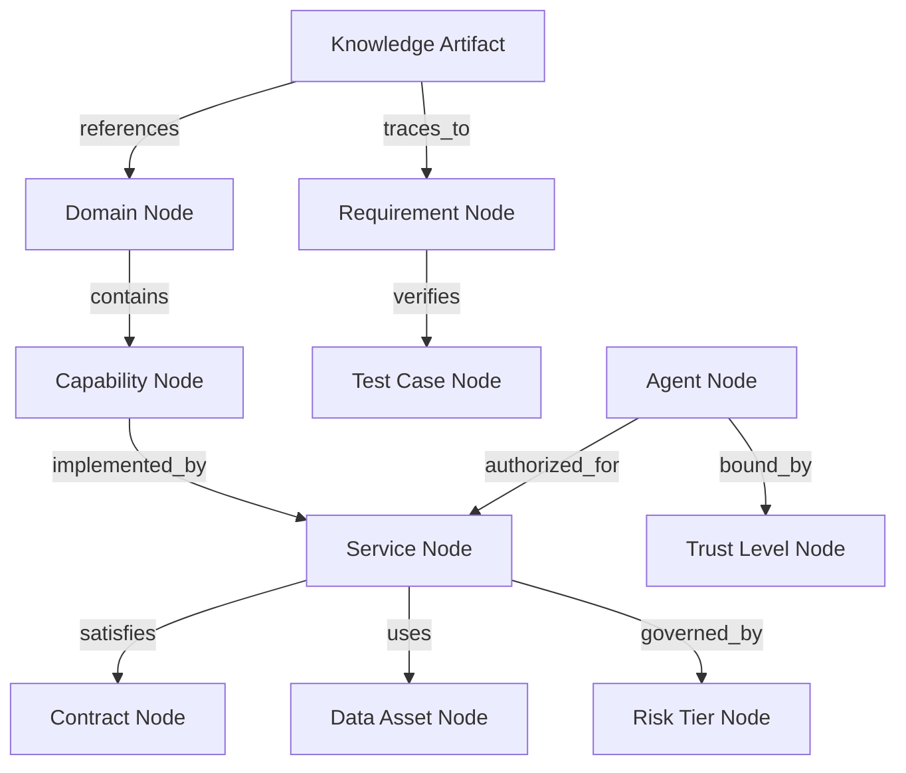

# AI-EOS Knowledge Architecture

## Document Metadata
* **id:** EOS-06-KNOW-ARCH
* **title:** AI-EOS Knowledge Architecture
* **description:** Specifies the standardized metadata contract, graph schemas, and structures for agent-consumable knowledge.
* **owner:** Knowledge Systems Architect
* **domain:** Enterprise Knowledge Management
* **tags:** [knowledge, schema, graph, metadata, agent-readable]
* **version:** 1.0.0
* **status:** Approved
* **created:** 2026-06-24T16:40:00Z
* **updated:** 2026-06-24T16:40:00Z
* **related_artifacts:** [01-constitution.md, 18-knowledge-quality-framework.md]
* **source_of_truth:** Git Repository
* **authority_level:** L2 - Governance
* **risk_tier:** Tier 3 — High
* **compliance_tags:** [ISO-27001-A.8, NIST-AI-RMF-Gov]
* **quality_score:** 1.00

---

## Purpose
Autonomous agents require structured, predictable documentation. This document mandates the Knowledge Artifact Contract and defines the Knowledge Graph Structure to make the Conductor codebase, documentation, and processes fully accessible and parsable by LLMs and software agents.

---

## Knowledge Artifact Contract (Mandatory)
Every knowledge artifact in the Conductor repository (including markdown documentation, specs, and prompts) must include a YAML frontmatter block adhering to this exact schema:

```yaml
id: <Unique ID matching pattern: EOS-XX-NAME or COND-XX-NAME>
title: <Human-readable Title>
description: <Short description of the artifact's purpose>
owner: <Role or Team name accountable for the artifact>
domain: <Domain from Architecture Meta-Model>
tags: [<list of indexing tags>]
version: <Semantic Version, e.g., 1.0.0>
status: <Draft | Proposed | Approved | Deprecated | Archived>
created: <ISO 8601 Timestamp>
updated: <ISO 8601 Timestamp>
related_artifacts: [<list of related IDs>]
source_of_truth: <Repository Path or External URI>
authority_level: <L1-Constitutional | L2-Governance | L3-Execution | L4-Operational>
risk_tier: <Tier 0 | Tier 1 | Tier 2 | Tier 3 | Tier 4>
compliance_tags: [<list of regulations, e.g., DPDP-India, GDPR, SOC2>]
quality_score: <Float value between 0.00 and 1.00 calculated by Quality Framework>
```

---

## Knowledge Graph Schema
To maintain relationship coherence across documentation, specifications, and code, artifacts are represented as nodes in an enterprise Knowledge Graph.



### Relationship Primitives
* `depends_on`: Direct code or functional dependency between services.
* `traces_to`: Upstream requirement mapping (e.g., Code traces to Specification).
* `governed_by`: Specifies the regulatory or governance document governing a component.
* `violates`: Used by compliance validators to flag mismatched permissions or patterns.

---

## Knowledge Ingestion Pipeline
1. **Parser:** Lint checks parse Markdown documents on commits to extract frontmatter.
2. **Validator:** Verifies presence of all 16 mandatory contract keys.
3. **Graph Builder:** Updates an internal network model (Neo4j or vector store metadata) representing the relationships.
4. **Agent Index:** Vectorizes the content and updates the RAG databases for active developers and agents.

---

## Lifecycle Policy
* **Review Cycle:** Semi-annually.
* **Revision Process:** Modifications approved by the Knowledge Systems Architect.

## Validation Rules
* CI/CD pipelines will fail any pull request containing documentation that lacks the mandatory frontmatter or contains invalid YAML syntax.

## Audit Requirements
* Monthly checks verify that the vector database references match active files in the `main` branch exactly, detecting and removing "stale" or orphan chunks.
