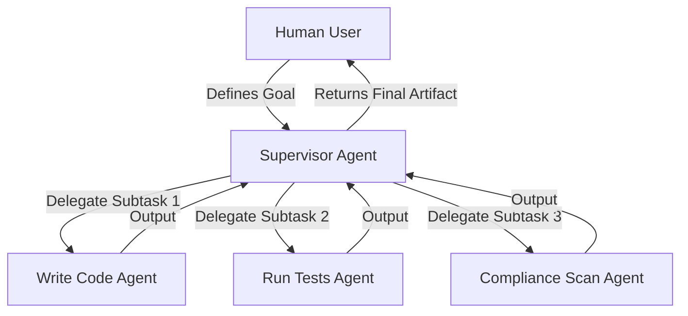

# AI-EOS Agent Orchestration Framework

## Document Metadata
* **id:** EOS-10-AG-ORCH
* **title:** AI-EOS Agent Orchestration Framework
* **description:** Defines the coordination schemas, state machines, and communication protocols for multi-agent execution.
* **owner:** AgentOps Lead & AI Systems Architect
* **domain:** AI Platform
* **tags:** [agent, orchestration, supervisor, swarm, protocol, state-machine]
* **version:** 1.0.0
* **status:** Approved
* **created:** 2026-06-24T16:48:00Z
* **updated:** 2026-06-24T16:48:00Z
* **related_artifacts:** [08-agent-architecture.md, 09-agent-trust-framework.md]
* **source_of_truth:** Git Repository
* **authority_level:** L2 - Governance
* **risk_tier:** Tier 3 — High
* **compliance_tags:** [NIST-AI-RMF-Gov, ISO-27001-A.12]
* **quality_score:** 1.00

---

## Purpose
This document governs how multiple agents interact, exchange data, and coordinate tasks. It specifies the allowed orchestration topologies and mandates state-machine controls to prevent execution loops, conflicting actions, and runaway resource consumption.

---

## Orchestration Topologies

Conductor authorizes three multi-agent coordination models:

### 1. Supervisor Model
A single high-level planning agent acts as the Supervisor, receiving goals, breaking them down into steps, routing sub-tasks to specialized worker agents, and aggregating the results.



* **Best Practice:** Used for core SDLC tasks, where high control and sequential validation are required.

### 2. Peer-to-Peer Model
Agents communicate directly with each other via message-passing (NATS channels), requesting information or triggering actions without a centralized supervisor.
* **Best Practice:** Allowed only for low-risk operations (e.g., alert dispatch, telemetry collection).

### 3. Swarm Model
A group of homogeneous agents dynamically partition a large volume of parallelizable tasks, coordinates work queues, and resolves conflicts.
* **Best Practice:** Used in batch processing WhatsApp message templating and quality inspections.

---

## Orchestration State Machine Controls

To prevent cascading errors, execution loops, or resource leaks, all multi-agent steps are controlled by a formal state machine:

```
[Idle] ──(Trigger)──> [Evaluating Plan] ──(Valid)──> [Executing] ──(Success)──> [Verifying] ──(Complete)──> [Done]
                                                        │
                                                     (Fail/Retry)
                                                        │
                                                        ▼
                                                  [Escalating] ──(Human Input)──> [Done]
```

### Execution Loop Detection
* Every agent task has a `maximum_depth` counter initialized to `0`.
* If a sub-task invokes another agent or tool, the counter increments.
* If `maximum_depth` exceeds `10`, the execution automatically halts, locks the workflow context, and escalates to a human operator.

### Rate Limiting and Token Budgets
* Max tokens per user-agent session: `500,000 tokens`.
* Max cost per execution trajectory: `$10.00 USD` equivalent.
* Exceeding these limits forces a hard stop, persisting the trajectory to the debugging registry.

---

## Lifecycle Policy
* **Review Cycle:** Annually.
* **Revision Process:** Modifications must be approved by the AI Systems Architect.

## Validation Rules
* Multi-agent execution manifests must be validated against the JSON schema definitions in the codebase before run.

## Audit Requirements
* Trace logs must capture the exact parent-child relations of all agent invocations, indicating which agent spawned which sub-task.
