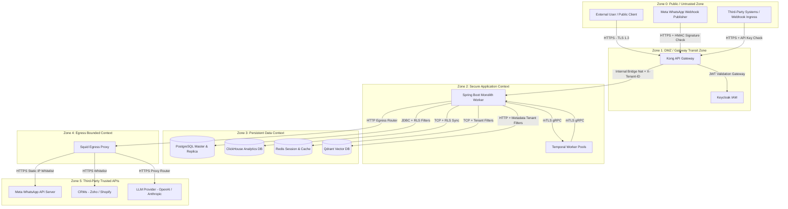

# Trust Boundaries Specification — Conductor Platform

This document identifies the trust zones, actors, and architectural boundaries of the Conductor Platform. It defines the rules governing authentication, authorization, and data flow transitions as information crosses from untrusted to trusted domains.

---

## 1. System Trust Map

The diagram below visualizes the boundaries separating the different zones of trust:

---

## 2. Identified Actors & Entities

We classify all entities interacting with the platform into distinct categories representing their level of access and trust:

### 2.1 External Users (Untrusted)
*   **Definition:** Public internet actors requesting browser-facing client interfaces or sending anonymous queries.
*   **Security Protocol:** Blocked at the Kong API Gateway. Must authenticate via OIDC credentials or present a valid token before accessing any resource.

### 2.2 Tenant Users (Semi-Trusted / Bounded)
*   **Definition:** Logged-in customers (business operators, campaign analysts) who own a workspace.
*   **Security Protocol:** Authenticated via Keycloak tenant-specific realms. Bound strictly by tenant scope mappings. Every call must pass the `X-Tenant-ID` header. Access limits enforced via RBAC.

### 2.3 Administrators (Privileged / Bounded)
*   **Definition:** Platform operations team, security managers, or global service managers.
*   **Security Protocol:** Mandated multi-factor authentication (MFA). Global write permissions are restricted. Subject to continuous trigger-based audit logging.

### 2.4 Internal Services (High Trust)
*   **Definition:** Spring Boot microservices modules (customer, messaging, integration, workflow).
*   **Security Protocol:** Rely on trace context headers (`traceparent`) and isolated bridge networks. Service-to-service communication requires token passing or secure event exchanges over NATS JetStream.

### 2.5 Third-Party Integrations (Untrusted Egress)
*   **Definition:** External platforms (Zoho, Shopify, Salesforce) invoked via custom webhooks or cron synchronizations.
*   **Security Protocol:** Outbound HTTP requests must pass through the Squid forward proxy. Direct network calls from the monolith container are prohibited.

### 2.6 AI Systems (Semi-Trusted Context)
*   **Definition:** LLM providers (OpenAI, Anthropic via LiteLLM) and local vector databases (Qdrant RAG).
*   **Security Protocol:** Vector indices must be filtered with metadata-based tenant isolation rules. Prompt mappers must block command injection.

### 2.7 Messaging Providers (Untrusted Ingress)
*   **Definition:** Meta WhatsApp Cloud API webhooks posting message status logs or customer opt-out replies.
*   **Security Protocol:** Webhooks verified via HMAC-SHA256 signatures matching the Meta App Secret. Reject unsigned requests.

### 2.8 Internal Infrastructure (Immutable Context)
*   **Definition:** PostgreSQL database, Redis caches, ClickHouse, NATS JetStream, and Temporal server.
*   **Security Protocol:** Internal network isolation. DB access restricted to authorized Spring Boot connection pools. Database trigger auditing captures all table modifications.

---

## 3. Trust Boundary Transitions

| Crossing Boundary | From Zone | To Zone | Threat Vector | Primary Security Control |
| :--- | :--- | :--- | :--- | :--- |
| **Ingress API Access** | Zone 0 (Public) | Zone 1 (DMZ) | Spoofing, Brute-Force, Token Hijacking | Keycloak realm routing, OAuth2 scope checks, JWT signature verification at Kong. |
| **Ingress Webhooks** | Zone 0 (Public) | Zone 1 (DMZ) | Denial of Service, Payload Tampering | Signature verification (HMAC-SHA256), immediate async ingestion queue (NATS JetStream). |
| **Context Propagation** | Zone 1 (DMZ) | Zone 2 (App Monolith) | Elevation of Privilege, Cross-Tenant Leakage | Gateway strip-down and injection of immutable `X-Tenant-ID` header. |
| **Database Operations**| Zone 2 (App Monolith) | Zone 3 (Databases) | SQL Injection, Tenant Data Pollution | Hibernate `@FilterDef` automatically injecting `tenant_id` to all queries. |
| **Workflow Worker** | Zone 2 (App Monolith) | Zone 2 (Temporal) | Worker Hijacking, DSL Tampering | mTLS client certificates, strict JSON DSL validation, runtime sandbox configurations. |
| **Egress Webhooks** | Zone 2 (App Monolith) | Zone 4 (Egress DMZ) | Server-Side Request Forgery (SSRF) | Squid egress proxy filtering out private subnets and routing traffic via static IPs. |
| **Semantic AI Queries** | Zone 2 (App Monolith) | Zone 3 (Qdrant Vector) | Vector Tenant Cross-Leakage | Programmatic injection of metadata filter (`tenant_id = activeTenant`) on vector search API. |

This specification establishes the perimeter structure for Conductor.
