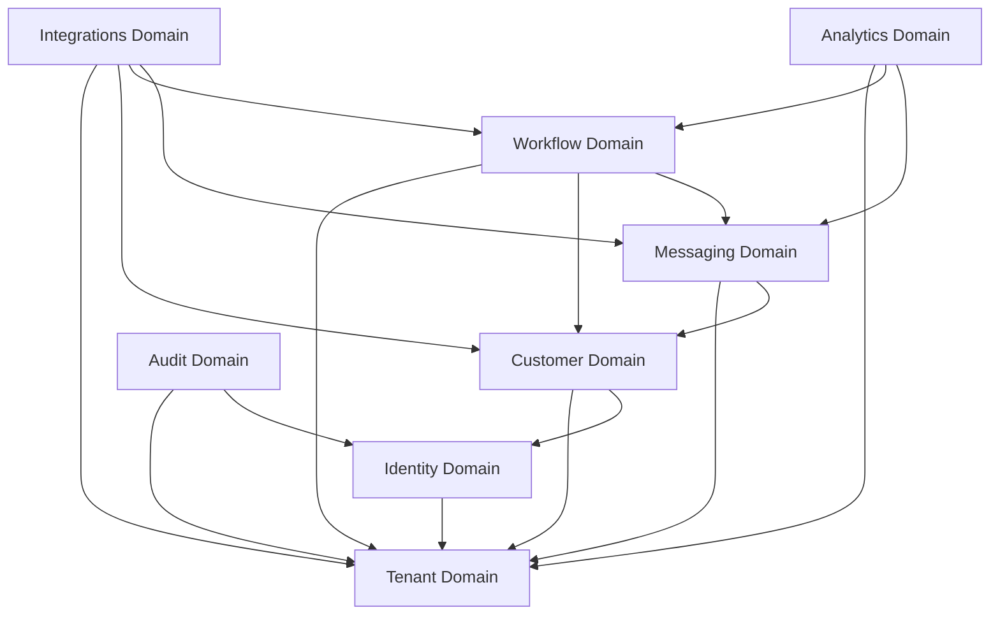

# MVP Domain Boundaries — Conductor

This document establishes the logical boundaries, responsibilities, inter-domain dependencies, and engineering ownership for the Conductor MVP. 

---

## 1. Tenant Domain

*   **Role:** Platform Foundation and Multi-Tenancy Core.
*   **Responsibilities:**
    *   Tenant account provisioning and lifecycle management.
    *   Organization and sub-organization hierarchy mapping.
    *   Billing subscription status caching (integration boundary with Razorpay).
    *   Tenant-scoped feature flag toggle lookup.
    *   Tenant context resolution from API Gateway headers (`X-Tenant-ID`).
*   **Dependencies:**
    *   *Internal:* None (lowest level system domain).
    *   *External:* None.
*   **Ownership:** Platform Core Module (`com.conductor.tenant`).

---

## 2. Identity Domain

*   **Role:** User Security, Identity Federation, and Role-Based Access Control (RBAC).
*   **Responsibilities:**
    *   User profile creation, updates, and lifecycle management.
    *   Authentication via OpenID Connect (OIDC) realm mappings.
    *   Dynamic role and permission mapping (`OWNER`, `ADMIN`, `MANAGER`, `AGENT`).
    *   API Key lifecycle management (bcrypt hashing and prefix validation).
    *   User context propagation to the execution thread context.
*   **Dependencies:**
    *   *Internal:* Tenant Domain (realms are dynamically bound to tenants).
    *   *External:* Keycloak Server (adopted Identity Provider).
*   **Ownership:** Identity & IAM Module (`com.conductor.identity`).

---

## 3. Customer Domain

*   **Role:** Contact Management Registry, Segmentation, and Compliance Logs.
*   **Responsibilities:**
    *   Unified Customer Registry containing contact details, tags, and custom metadata attributes.
    *   Bulk contact imports via asynchronous CSV processing.
    *   Static and dynamic customer list segmentation.
    *   **Immutable Consent Ledger:** Maintain the append-only record of customer opt-in/opt-out statements.
    *   **Right to Erasure (DPDP):** Automated task executing contact anonymization/pii-erasure under the 30-day compliance SLA.
*   **Dependencies:**
    *   *Internal:* Tenant Domain (all contacts logically isolated by `tenant_id`), Identity Domain (RBAC check for modifications).
    *   *External:* PostgreSQL RDS (direct database layer).
*   **Ownership:** Customer Registry Module (`com.conductor.customer`).

---

## 4. Workflow Domain

*   **Role:** Automation Engine, Execution State Machine, and Orchestrator.
*   **Responsibilities:**
    *   Parsing and schema validation of the custom JSON-based Workflow DSL.
    *   Event-to-trigger matching (mapping incoming events to workflow entry points).
    *   Workflow runtime state management, step executions, wait delays, and retry cycles.
    *   Context variable interpolation and execution state history recording.
*   **Dependencies:**
    *   *Internal:* Tenant Domain (logical boundary), Customer Domain (reading contact profiles and consent settings), Messaging Domain (invoking template outputs).
    *   *External:* Temporal Orchestrator (adopted runtime engine for workflow state tracking), NATS JetStream (trigger event ingestion).
*   **Ownership:** Workflow Engine Module (`com.conductor.workflow`).

---

## 5. Messaging Domain

*   **Role:** Communication Dispatch, Callback Tracking, and Provider Interface.
*   **Responsibilities:**
    *   Inbound message ingestion, payload parsing, and HMAC webhooks verification.
    *   Outbound message dispatching via the Meta Cloud API.
    *   Status callback tracking (mapping `sent`, `delivered`, `read`, and `failed` updates to database events).
    *   WhatsApp Template synchronization, schema registration, and approval lifecycle monitoring.
    *   Mandatory keyword interception (processing "STOP" unsubscribes to opt-out contacts in under 5 seconds).
*   **Dependencies:**
    *   *Internal:* Tenant Domain (routing context), Customer Domain (blocking marketing messages if not explicitly opted-in).
    *   *External:* Meta WhatsApp Cloud API (provider endpoint).
*   **Ownership:** Adapter Gateway Module (`com.conductor.messaging`).

---

## 6. Integrations Domain

*   **Role:** Egress Adapters, Ingress Webhooks, and Data Synchronizers.
*   **Responsibilities:**
    *   Ingress Webhook handlers for external triggers (Shopify orders, Zoho CRM lead changes).
    *   Transformation of vendor-specific webhooks into structured Conductor system events.
    *   Outbound integration calls (Shopify checkout, Zoho CRM lead updates) from within workflow actions.
    *   Razorpay subscription creation, webhook consumption, and billing state mapping.
*   **Dependencies:**
    *   *Internal:* Tenant Domain, Customer Domain, Workflow Domain (injecting events), Messaging Domain.
    *   *External:* Razorpay API, Zoho CRM API, Shopify API. All outbound calls route through the Squid Proxy.
*   **Ownership:** Integrations Adapter Module (`com.conductor.integration`).

---

## 7. Analytics Domain

*   **Role:** Telemetry Agregation, Performance Dashboarding, and Embeds.
*   **Responsibilities:**
    *   Asynchronous event streaming ingestion for message delivery and workflow progression.
    *   Feeding denormalized PostgreSQL tables optimized for metric reporting.
    *   Hosting signed JWT verification endpoints enabling secure Metabase iframe embeds.
    *   Computing campaign CTR, deliverability ratios, and workflow execution drop-off rates.
*   **Dependencies:**
    *   *Internal:* Tenant Domain, Workflow Domain, Messaging Domain.
    *   *External:* Metabase Server (adopted BI visualization), PostgreSQL Read Replicas.
*   **Ownership:** Analytics Core Module (`com.conductor.analytics`).

---

## 8. Audit Domain

*   **Role:** Security Ledger, Event Sourcing, and Compliance Records.
*   **Responsibilities:**
    *   Writing write-once, append-only logs for all administrator and platform operations.
    *   Enforcing physical partitioning schemes for audit logs by date and tenant.
    *   Tracing system parameter updates (e.g. system configurations, IAM role alterations).
*   **Dependencies:**
    *   *Internal:* Tenant Domain, Identity Domain (capturing user contexts).
    *   *External:* PostgreSQL RDS (partitioned append-only target).
*   **Ownership:** Security & Compliance Module (`com.conductor.audit`).
