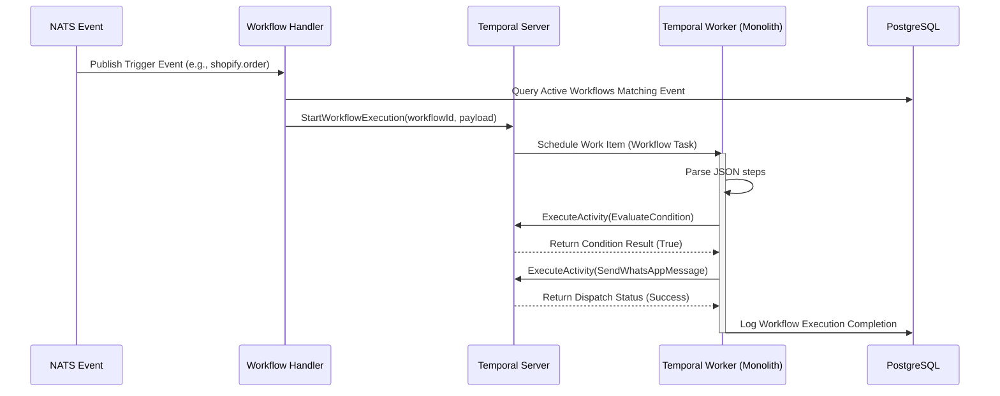

# Workflow Engine & Channel Integration Plan — Conductor

This document defines the functional design, JSON DSL schemas, execution models, and integration pathways for the Conductor Workflow Engine, WhatsApp Cloud API channel, and core third-party integrations (Shopify, Razorpay, Zoho CRM).

---

## 1. Workflow Definition Model (JSON DSL)

Workflows are configured as JSON definitions. Below is the JSON Schema representation of the Conductor Workflow DSL:

```json
{
  "$schema": "http://json-schema.org/draft-07/schema#",
  "title": "ConductorWorkflowDSL",
  "type": "object",
  "properties": {
    "workflow_id": { "type": "string", "format": "uuid" },
    "name": { "type": "string" },
    "description": { "type": "string" },
    "trigger": {
      "type": "object",
      "properties": {
        "event_source": { "type": "string", "enum": ["shopify", "zoho_crm", "whatsapp", "manual"] },
        "event_type": { "type": "string" },
        "deduplication_key": { "type": "string" }
      },
      "required": ["event_source", "event_type"]
    },
    "variables": {
      "type": "object",
      "additionalProperties": { "type": "string" }
    },
    "steps": {
      "type": "array",
      "items": {
        "type": "object",
        "properties": {
          "id": { "type": "string" },
          "type": { "type": "string", "enum": ["condition", "action", "delay"] },
          "config": { "type": "object" }
        },
        "required": ["id", "type", "config"]
      }
    }
  },
  "required": ["name", "trigger", "steps"]
}
```

### Core Concepts Mapped:
1.  **Trigger:** Declares the event source and topic subscription.
2.  **Condition:** Logical operators evaluating variables. Example JSON:
    ```json
    {
      "left": "customer.tags",
      "operator": "contains",
      "right": "VIP"
    }
    ```
3.  **Action:** The execution unit (e.g., `send_whatsapp_template`, `create_zoho_lead`).
4.  **Variables & Context:** Key-value pairs compiled during execution. Workflow starts with dynamic trigger payload fields (e.g. `{{trigger.order_id}}`, `{{customer.name}}`) and updates state context parameters downstream.
5.  **Execution State:** Recorded in the `workflow_executions` table tracking active, cancelled, or completed statuses.

---

## 2. Workflow Runtime Model (Temporal Orchestration)

The execution engine translates the JSON DSL into a durable **Temporal Workflow**:



### Runtime Policies:
*   **Execution Lifecycle:** Events matching active trigger registrations are caught by Conductor, pushing a Start request to Temporal.
*   **Retry Policy:** Temporal Activities (like sending message API calls) configure standard exponential backoffs:
    *   `InitialInterval`: 2 seconds.
    *   `BackoffCoefficient`: 2.0.
    *   `MaximumAttempts`: 5.
    *   `NonRetryableErrorTypes`: `ConsentBlockedException`, `InvalidPhoneException`, `UnsubscribedTenantException`.
*   **Failure & Compensation:** If an action fails after all retries, the workflow marks status as `failed` in SQL and fires a warning notification event to `workflow.events.failed`.
*   **Observability:** Execution progress is recorded in `workflow_executions.steps_executed` in JSON format, capturing step durations and error traces.

---

## 3. WhatsApp Integration Flows

### Inbound Flow
1.  **Meta Webhook POST:** The Node.js Webhook Adapter receives raw messages/status events from Meta.
2.  **Validation:** Checks `X-Hub-Signature-256` header against the system Meta App Secret:
    ```javascript
    const crypto = require('crypto');
    const signature = req.headers['x-hub-signature-256'];
    const hmac = crypto.createHmac('sha256', APP_SECRET).update(req.rawBody).digest('hex');
    if (`sha256=${hmac}` !== signature) throw new Error('Invalid Signature');
    ```
3.  **Parsing & Routing:** Exclude non-standard hooks, parse payloads to a standard schema, publish to NATS subject `whatsapp.inbound.event`, and return an immediate HTTP `200 OK` to Meta.
4.  **STOP Processing:** Inbound message checks keywords. If matching "STOP" or "UNSUBSCRIBE", immediately execute `CustomerConsentService.optOut(phone)` in the database to guarantee compliance under 5 seconds.

### Outbound Flow
1.  **Workflow Dispatch:** Temporal Activity invokes the Spring Boot Outbound Message client.
2.  **Consent Gate Check:** The monolith queries the contact's opt-in state:
    *   If `wa_opt_in_status` is not `opted_in`, abort the task with `ConsentBlockedException`.
3.  **Meta Request:** Dispatch an HTTPS POST request to Meta's Cloud API:
    `https://graph.facebook.com/v20.0/{phone_number_id}/messages` containing the JSON payload with templates variables.
4.  **Audit Write:** Write a pending message status entry to the partitioned `messages` table.

### Template Flow
1.  **Creation:** Users author template copies (header, body, buttons, and template variable count) in the dashboard.
2.  **Submission:** Expose a POST endpoint transmitting structural layouts to Meta.
3.  **State Sync:** A background thread polls Meta's status API or catches Meta's approval webhook triggers, updating local statuses inside the `templates` table (`approved`, `rejected`).

### Failure & DLQ Rules
*   Failed API attempts (e.g. rate limit codes `100`, `130000`) trigger Temporal retry.
*   If persistent failures occur, messages are updated to status `failed` with the error payload.
*   The raw events are published to NATS topic `whatsapp.dlq` for alerting and manual support review.

---

## 4. Integration Adaptors Architecture

We define integrations for Razorpay, Zoho CRM, and Shopify:

### 1. Razorpay Integration
*   **Capabilities:** Capture subscription status and update billing records.
*   **Events:** `subscription.charged`, `payment.failed`, `subscription.cancelled`.
*   **Sync Direction:** Inbound (Razorpay webhook triggers database subscription upgrades or halts).
*   **Authentication:** Razorpay Webhook Signature validation (uses a secret token verified using HMAC-SHA256).
*   **Failure Strategy:** Webhook failure triggers Razorpay retry. Internal processors process webhooks idempotently using the unique `razorpay_payment_id`.
*   **Ownership:** `com.conductor.integration.razorpay`

### 2. Zoho CRM Integration
*   **Capabilities:** Sync leads into customer registry and trigger workflows upon status changes.
*   **Events:** `lead.created`, `deal.updated`.
*   **Sync Direction:** Bidirectional (sync leads inbound; workflow actions can update deal pipeline stages outbound).
*   **Authentication:** OAuth2 authorization code flow with refresh token rotation stored in the integration credentials vault.
*   **Failure Strategy:** Outbound requests use Temporal retry. Inbound failures write details to integration failure logs for user review in the dashboard.
*   **Ownership:** `com.conductor.integration.zoho`

### 3. Shopify Integration
*   **Capabilities:** Capture checkout abandoned flows, orders placed, and shipping changes.
*   **Events:** `orders/create`, `checkouts/abandon`, `fulfillment/update`.
*   **Sync Direction:** Inbound (Shopify webhooks trigger campaign workflows).
*   **Authentication:** Shopify client verification using webhook HMAC header signature.
*   **Failure Strategy:** Duplicate filters block reprocessing. If processing fails, store details in the execution history.
*   **Ownership:** `com.conductor.integration.shopify`

---

## 5. MVP Workflow Templates Library

Below are the 4 predefined templates that tenants can deploy instantly:

### 1. Lead Capture Template
*   **Trigger:** Ingress Event (Zoho CRM Lead Created `lead.created`).
*   **Conditions:** Check if contact does not have the tag `opted_out`.
*   **Actions:** 
    1. Send WhatsApp Opt-In request template asking for message permissions.
    2. Wait 24 hours.
    3. Evaluate if consent was received. If not, tag lead as `consent_ignored` and end workflow.
*   **Expected Outcome:** Contacts verify consent status early, paving the way for campaigns.

### 2. Appointment Reminder Template
*   **Trigger:** External API Event `appointment.booked`.
*   **Conditions:** Contact has status `opted_in`.
*   **Actions:**
    1. Calculate delay: `appointment_time - 24 hours` (utilize Temporal delay scheduling).
    2. Send WhatsApp Utility Template containing the date, time, and dynamic confirmation buttons ("Confirm", "Reschedule").
    3. If user clicks "Reschedule", trigger support escalation event.
*   **Expected Outcome:** Reduction in customer no-show rates via interactive responses.

### 3. Payment Reminder Template
*   **Trigger:** External Event `invoice.overdue` (or Shopify checkout abandon).
*   **Conditions:** `invoice.amount_due > 100 INR` and customer `wa_opt_in_status == opted_in`.
*   **Actions:**
    1. Query dynamic Razorpay payment URL for the target checkout instance.
    2. Send WhatsApp Marketing/Utility template enclosing the payment link button.
    3. Wait 3 days. Check invoice status. If unpaid, send followup message.
*   **Expected Outcome:** Direct boost in collections and completed checkout cycles.

### 4. Customer Support Escalation Template
*   **Trigger:** Inbound Message containing keywords like "HELP", "SUPPORT", or manual triggers by agents.
*   **Conditions:** Active support agent is not currently assigned.
*   **Actions:**
    1. Update status of `conversations` to `agent_assigned`.
    2. Broadcast NATS message to Slack/Agent Dashboard alert queue.
    3. Send WhatsApp auto-reply template: "Our support agents have been notified. We will connect with you shortly."
*   **Expected Outcome:** Seamless 2-way handover from automated flows to customer support agents.
