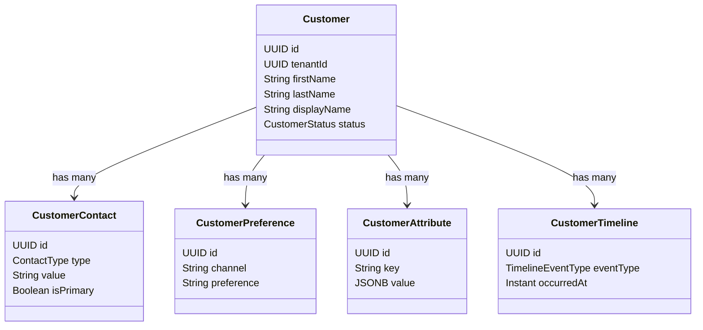

# Customer 360 Architecture

The Customer 360 view aggregates customer profiles, relationships, attributes, timeline history, and preferences.

## Data Structures

## Consolidated Profile Resolution
The Customer 360 view combines:
1. Contact cards with primary indicators.
2. Custom attributes (key-value bags).
3. Preferences (opt-in/opt-out per channel).
4. Direct relationships (Household, referred-by).
5. Append-only chronological timeline.
