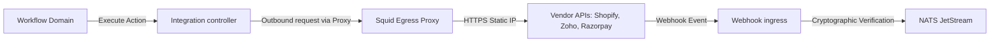

# Integration Hub Specification

This document details the design, architecture, and orchestration workflows of the reusable Integration Hub within the Conductor Platform.

## 1. Architecture Overview

The Integration Hub acts as the secure egress-ingress boundary that bridges Conductor workflow execution blocks with external business platforms (CRM, E-Commerce, payment systems).

## 2. Key Modules & Subsystems

*   **Connector SDK:** Declares standard connector hooks (`ConnectorAdapter`) that normalize external service APIs.
*   **OAuth Management:** Handles dynamic callback exchange, tokens caching, expiration checking, and automatic refresh cycles.
*   **Webhook Framework:** Ingests external vendor pushes, enforces cryptographically secure HMAC/signature verification, checks for replay attacks, and translates inputs into canonical events.
*   **Credential Store:** Implements AES-256-GCM column encryption for vendor client secrets and passwords utilizing local environment keys.
*   **Transformation Engine:** Resolves field conversions, nested dot-paths lookup, and normalization schemas.

## 3. Security Boundary Controls

1.  **Row-Level Partitioning:** Every configuration is mapped to a `tenant_id` column. Spring Data aspect hooks automatically scope queries.
2.  **Squid Proxy Mandate:** Direct outbound internet requests are blocked. Outgoing client instances must declare the forward proxy destination.
3.  **Audit Ledger:** Every connection mutation, credential rotation, or execution registers audit logs.
