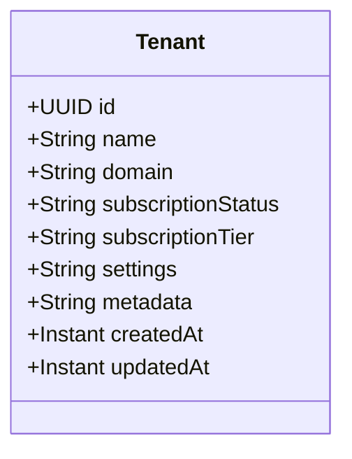

# Tenant Domain Specification — Conductor Platform

This specification describes the Tenant domain, covering models, lifecycle states, validations, and the database schema.

---

## 1. Context & Architecture

The Tenant Domain is the foundation of multi-tenancy in Conductor. It provides the registration ledger and profile data for all tenants.

### Ubiquitous Language
*   **Tenant**: An isolated business entity representing a customer workspace.
*   **Subscription Tier**: The pricing tier (Free, Standard, Enterprise) dictating feature flags and limits.
*   **Subscription Status**: The active subscription state (Active, Suspended, Deactivated).

---

## 2. Domain Models



---

## 3. Database Schema

```sql
CREATE TABLE tenants (
    id UUID PRIMARY KEY,
    name VARCHAR(255) NOT NULL,
    domain VARCHAR(255) NOT NULL UNIQUE,
    subscription_status VARCHAR(50) NOT NULL,
    subscription_tier VARCHAR(50) NOT NULL,
    settings JSONB,
    metadata JSONB,
    created_at TIMESTAMP WITH TIME ZONE NOT NULL,
    updated_at TIMESTAMP WITH TIME ZONE NOT NULL
);
```

---

## 4. Operational Capabilities

### 4.1 Create Tenant
- **Endpoint**: `POST /api/v1/tenants`
- **Validation**: Domain name must be unique and alphanumeric.
- **Side Effects**: Provision Keycloak realm (`conductor-{tenantId}`), create default clients, deploy default roles, publish `tenant.created` event, log audit trail.

### 4.2 Suspend / Deactivate Tenant
- **API**: `POST /api/v1/tenants/{id}/suspend`
- **Effect**: Updates status to `SUSPENDED`. Blocks all active campaigns and inbound webhook receivers.
