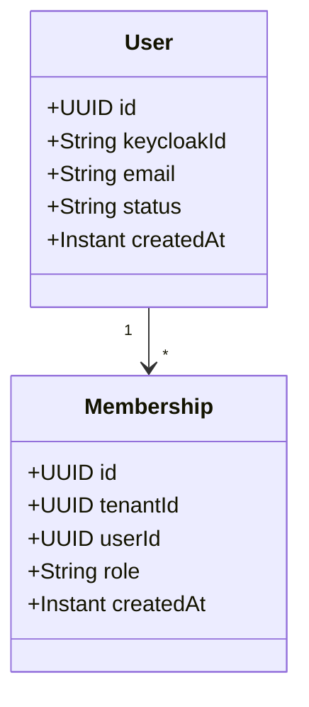

# User Domain Specification — Conductor Platform

This specification describes the User domain, detailing identity records, profiles, and workspace membership structures.

---

## 1. Context & Architecture

Users represent human actors accessing the Conductor Platform. A single user (email) can belong to multiple tenants, with distinct roles assigned inside each tenant context through `Membership` mappings.

---

## 2. Domain Models



---

## 3. Database Schema

```sql
CREATE TABLE users (
    id UUID PRIMARY KEY,
    keycloak_id VARCHAR(255) NOT NULL UNIQUE,
    email VARCHAR(255) NOT NULL UNIQUE,
    status VARCHAR(50) NOT NULL,
    created_at TIMESTAMP WITH TIME ZONE NOT NULL,
    updated_at TIMESTAMP WITH TIME ZONE NOT NULL
);

CREATE TABLE memberships (
    id UUID PRIMARY KEY,
    tenant_id UUID NOT NULL,
    user_id UUID NOT NULL,
    role VARCHAR(50) NOT NULL,
    created_at TIMESTAMP WITH TIME ZONE NOT NULL
);
```

---

## 4. Lifecycle Capabilities

### 4.1 Invite User
- User is created in keycloak with status `INVITED`.
- A membership mapping is added link the user UUID to the active tenant with the specified role.

### 4.2 Deactivate User
- Standard role removal from Keycloak. Updates database status to `DEACTIVATED`.
- Any active sessions are terminated.
