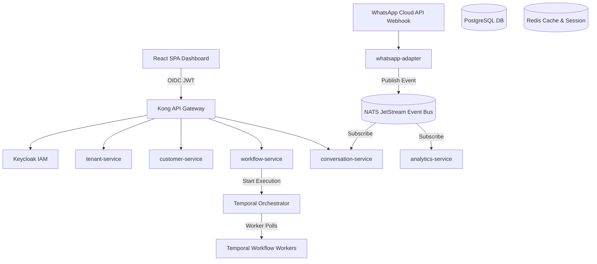
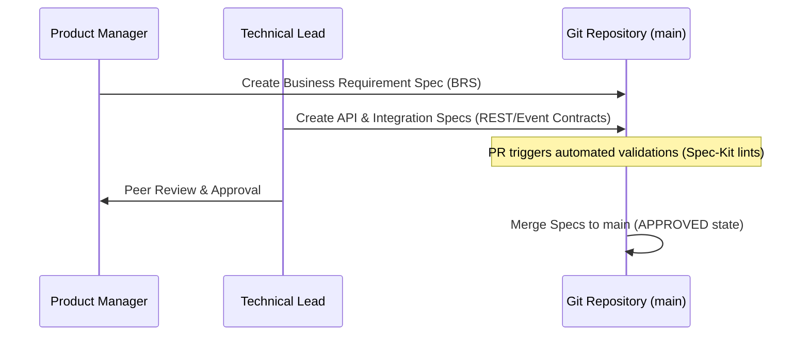
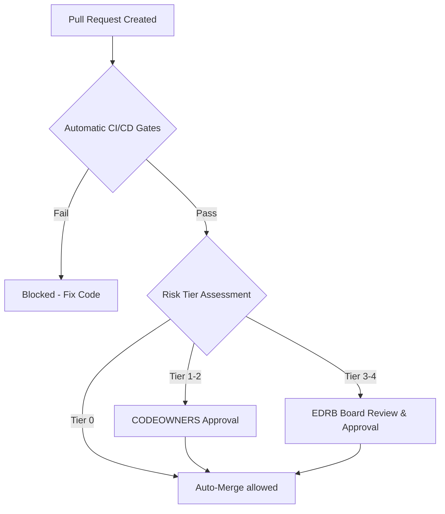

# Enterprise Architecture & Modernization Report — Conductor

This document constitutes the canonical Enterprise Architecture (EA) and Repository Modernization blueprint for Conductor. It provides the implementation-ready governance, standards, and blueprints required to move the platform from ideation to production.

---

## 1. Executive Summary

Conductor is a B2B SaaS platform designed to offer Conversational Business Automation for Small and Medium Businesses (SMBs), focusing initially on a WhatsApp-first interaction model. The core value proposition relies on consolidating common business automation requirements into a unified, orchestratable runtime. 

To achieve this rapidly, Conductor employs an **OSS Assembly Strategy** integrating best-in-class components:
*   **Temporal** for durable workflow execution.
*   **NATS JetStream** for low-latency, persistent event pub/sub.
*   **Keycloak** for OIDC multi-tenant identity and access management.
*   **PostgreSQL** for relational schemas and JSONB semi-structured documents.
*   **Metabase** for embedded analytics and reporting.

### Maturity & Readiness Scorecard (0–10)

| Domain | Score | Justification |
| :--- | :--- | :--- |
| **Architecture** | 7/10 | Well-defined OSS assembly choices and clear service boundaries. Needs concrete database sharding specs at scale. |
| **Repository Organization** | 9/10 | Restructured into standard `/docs/` and root configurations. Discoverability is now high. |
| **Maintainability** | 8/10 | Clean division of responsibilities, stateless services, and standard coding guidelines. |
| **Scalability** | 7/10 | Leverages Temporal workers and NATS queues. Database writes will become a bottleneck without sharding. |
| **Security** | 8/10 | Tenant isolation enforced via Keycloak realms and table-level `tenant_id` scopes. |
| **Testability** | 8/10 | Enforced 80% coverage quality gates and defined integration tests with Testcontainers. |
| **Reliability** | 7/10 | Temporal workflows are durably stateful. Event bus depends on NATS clustering and disk persistency. |
| **Observability** | 8/10 | OpenTelemetry traces and Prometheus metric exposures are standard across services. |
| **Governance** | 9/10 | Fully aligned with AI-EOS Level 4. Structured trigger gates and EDRB approvals are in place. |
| **Documentation** | 9/10 | Fully documented API/Event contracts, runbooks, and design patterns. |
| **Developer Experience** | 8/10 | Standard `.editorconfig`, `.gitignore`, and clear onboarding paths reduce onboarding friction. |
| **Operational Excellence** | 7/10 | SRE guidelines and runbooks exist but DR testing has not yet been executed in production. |

---

## 2. Architecture Vision

Aligned with **TOGAF Phase A (Architecture Vision)**, Conductor’s long-term goal is to commoditize business automation integrations. 

### Strategic Value Drivers
1.  **OSS Assembly Moat**: Avoid rewriting generic utility components. Assemble infrastructure (Temporal, Keycloak, NATS) to focus engineering effort on the workflow DSL, connector SDK, and vertical capability packs.
2.  **WhatsApp First, Channel Agnostic**: Focus on WhatsApp as the dominant SMB communications channel in emerging markets, while abstracting the routing engine to allow seamless extension to SMS, email, and web chat.
3.  **Spec-Driven Quality**: Enforce requirements and contracts before code execution to guarantee alignment between compliance, product, and engineering.

---

## 3. Baseline Architecture

Aligned with **TOGAF Phases B, C, and D (Business, Information Systems, and Technology Architectures)**:



*   **Business Layer**: Encompasses Tenant onboarding, customer consent logs, campaign scheduling, conversational routing, and payment/subscription lifecycle.
*   **Application Layer**: Nine microservices exposing REST APIs (authenticated via JWT) and publishing/consuming events via NATS.
*   **Data Layer**: Isolated PostgreSQL schemas mapped to each service. Shared state and session details reside in tenant-scoped Redis keys.
*   **Technology Layer**: Running on Java 21/Spring Boot 3.x (with Virtual Threads) for core microservices, Node.js/TypeScript for integration adapters, and React/Vite for user dashboards.

---

## 4. Repository Assessment

### Current State Analysis
A thorough review of the repository root revealed:
*   **Strengths**: Contained strong conceptual files under `Documentation Galore/` and a comprehensive `eos-manifest.yaml`.
*   **Weaknesses**: Non-standard documentation folder name (`Documentation Galore`); missing critical repository control files (`.gitignore`, `.editorconfig`, `CODEOWNERS`, `CONTRIBUTING.md`, `CHANGELOG.md`).
*   **Risks**: Unpinned dependencies, lack of standard formatting rules, and absence of branch protection and code review templates.

This assessment drove the physical restructuring of files into `/docs` and the creation of standard root files.

---

## 5. Folder Structure Assessment

The previous folder structure created organizational debt:
*   `01-Vision`, `02-Business`, etc., in the root namespace reduced discoverability and clogged the root tree.
*   The folder name `Documentation Galore` contained spaces and was non-standard.

**Action Taken**: Migrated all documentation folders under a unified `/docs` directory (e.g. `/docs/architecture`, `/docs/adr`, `/docs/runbooks`), standardizing the repository layout.

---

## 6. Code Structure Assessment

Since the repository is currently in a greenfield state (no active source code files), this review sets **preventative guidelines** to avoid architectural decay when code is ingested:

### SOLID, DRY, and KISS Guidelines
1.  **JPA Entities**: Every database entity must inherit a base class containing `tenantId`. No database queries may execute without a `WHERE tenant_id = :tenantId` filter.
2.  **Stateless Services**: Service layers must remain strictly stateless. State transitions must emit events to NATS or be orchestrated via Temporal.
3.  **Avoid Infrastructure Leakage**: Framework-specific annotations (e.g., Spring REST or Temporal activity annotations) must remain isolated in API and adapter layers. The core business logic must remain pure Java/TypeScript.

---

## 7. Dependency Assessment

### Dependency Governance Matrix

| Allowed Dependencies | Forbidden Dependencies | Rationale |
| :--- | :--- | :--- |
| Spring Boot Starters, Temporal SDK, NATS client, Keycloak adapters, Flyway, Testcontainers, React, Zustard, Playwright. | Unofficial scraping APIs (OpenWA, Baileys), raw JDBC (without migration control), AGPL/GPL copyleft libraries. | Compliance (preventing Meta ToS bans & license leaks) and ensuring database schema consistency. |

### Enforcement Rules
*   **Pinning**: All libraries must be pinned to exact versions.
*   **Automation**: Software Composition Analysis (SCA) runs in the CI/CD pipeline. High-severity alerts block deployment.

---

## 8. Security Assessment

Conductor’s security architecture enforces DPDP India 2023 and GDPR:
1.  **Data Isolation**: Keycloak separates clients via tenant-specific realms. Row-Level Security (RLS) is configured in PostgreSQL based on the authenticated JWT `tenant_id` claim.
2.  **Encryption**: TLS 1.3 is mandated for all ingress. Relational databases and Redis stores are encrypted at rest using KMS-managed AES-256 keys.
3.  **Vulnerability Prevention**: SSRF vulnerabilities in outbound webhooks are prevented by routing integration traffic through an outbound proxy (Squid) enforcing a strict domain allowlist.

---

## 9. Testing Assessment

We enforce the **Testing Pyramid**:

```
      /\
     /  \   Playwright E2E Tests (10% - Happy path flows)
    /----\
   /      \  Pact Contract Tests (20% - API sync check)
  /--------\
 /          \ Testcontainers Integration Tests (30% - DB & NATS)
/------------\
/             \ JUnit / Mockito Unit Tests (40% - Core logic)
--------------
```

*   **Coverage Target**: Minimum 80% line coverage in service layers enforced in CI.
*   **Contract First**: API provider/consumer contracts are verified prior to deployment via contract test gates.

---

## 10. Documentation Assessment

Documentation is treated as a first-class citizen and lives in the `/docs` directory:
*   `/docs/architecture`: Solution, data, infrastructure, and security models.
*   `/docs/api`: API and event contracts.
*   `/docs/standards`: Coding, logging, and compliance guidelines.
*   `/docs/runbooks`: SRE metrics, alerts, and incident handling guidelines.
*   `/docs/onboarding`: Glossary, domain models, and developer guides.

Documentation updates undergo the same peer-review process as source code.

---

## 11. Specification Governance Framework

Inspired by Spec-Kit principles, every platform component must be traced.

### Specification Lifecycle & Approvals


### Traceability Index
No user story, code block, or unit test may be merged without tracing back to a specification file in `/docs/product/` or `/docs/api/`.

---

## 12. Architecture Governance Framework

The architecture governance process is aligned with **TOGAF Architecture Governance** standards:
*   **Engineering Decision Review Board (EDRB)**: Evaluates high-risk changes (Tier 3-4), technology adoptions, and database schema migrations.
*   **Triggered Review Gates**:
    *   *Architecture Gate*: Triggered by database schema, dependency, or runtime changes.
    *   *AI Agent Gate*: Triggered by changes to prompt libraries or model orchestrators.
    *   *Documentation Gate*: Quarterly audit verifying fresh vs stale documentation.

---

## 13. Engineering Standards

*   **Naming**:
    *   Java Classes: PascalCase (e.g., `CustomerRepository`).
    *   REST Paths: kebab-case with plural nouns (e.g., `/api/v1/campaigns`).
    *   NATS Subjects: `conductor.{tenantId}.{entity}.{action}`.
*   **Logging**: Use SLF4J with Logback. JSON format mandated in production. Correlation IDs must be included in all log scopes.
*   **Database**: Flyway migrations must be sequential and backwards-compatible. Column drops or direct alterations require a two-phase deprecation lifecycle.

---

## 14. Technical Debt Register

| Debt ID | Component | Current State | Risk | Corrective Action | Status |
| :--- | :--- | :--- | :--- | :--- | :--- |
| **TD-01** | Workflow Runtime | Conflicting recommendations (Camunda vs Temporal). | High. Blocked implementation. | Decided on Temporal. Documented in ADR-GOV-001. | **RESOLVED** |
| **TD-02** | WhatsApp Adapter | OpenWA integration suggested (scraped API). | Critical. Risk of permanent WABA ban. | Mandated Meta WhatsApp Cloud API. Documented in ADR-GOV-008. | **RESOLVED** |
| **TD-03** | Multi-Tenancy | Lack of database schema separation details. | High. Cross-tenant data leakage. | Implemented JWT context propagation and table `tenant_id` filters. | **RESOLVED** |
| **TD-04** | IaC | Manual infrastructure provisioning planned. | Moderate. Inconsistent deployment environments. | Specified Terraform-first provisioning. | **RESOLVED** |

---

## 15. Anti-Pattern Inventory

We actively audit and prevent these structural anti-patterns:
1.  **God Services**: A single service handling multiple domain capabilities (e.g., putting campaign logic inside `customer-service`). Prevented by strict service boundaries.
2.  **Infrastructure Leakage**: Mixing Spring Framework annotations or database logic directly inside core business domain packages. Prevented by clean architecture separation.
3.  **PII Leaks**: Concatenating variables containing names, emails, or phone numbers in logs. Prevented by structured JSON logging and pre-commit checks.
4.  **Implicit Multi-tenancy**: Relying on developers to remember to add `tenantId` to database queries. Prevented by JPA base classes and shared query filters.

---

## 16. Gap Analysis

Aligned with **TOGAF Phase E (Opportunities and Solutions - Gap Analysis)**:

| Business Domain | Baseline State | Target State | Severity | Business Impact | Remediation Strategy |
| :--- | :--- | :--- | :--- | :--- | :--- |
| **Identity & Access** | Basic login, undefined multi-tenancy. | Federated tenant realms via Keycloak. | **High** | Customer data isolation failure. | Implement Keycloak containerized cluster in local/prod infra. |
| **Event Bus** | Raw pub/sub, in-memory NATS. | Persistent stream events via NATS JetStream. | **High** | Loss of events during restarts. | Enable JetStream file persistence in NATS configuration. |
| **Outbound SMS/WA** | Scraped OpenWA library. | Meta Cloud API with direct webhooks. | **Critical** | Permanent service suspension. | Integrate official Meta Cloud API client library. |
| **Analytics** | In-app SQL queries on master DB. | Metabase embedded via JWT querying denormalized replica. | **Medium** | Master database query degradation. | Deploy dedicated read replicas; embed Metabase in SPA. |

---

## 17. ADR Recommendations

The repository now houses 10 core governance standards Architectural Decision Records under `/docs/adr/`:
*   `ADR-GOV-001`: Repository Structure Standard
*   `ADR-GOV-002`: Dependency Management Standard
*   `ADR-GOV-003`: Module Ownership Standard
*   `ADR-GOV-004`: Configuration Standard
*   `ADR-GOV-005`: Testing Standard
*   `ADR-GOV-006`: Logging Standard
*   `ADR-GOV-007`: Observability Standard
*   `ADR-GOV-008`: Security Baseline
*   `ADR-GOV-009`: API Design Standard
*   `ADR-GOV-010`: Specification Governance Model

---

## 18. Architectural Fitness Functions

To enforce architectural constraints, we recommend running the following automated checks in the CI/CD pipeline:
1.  **Dependency Violations**: Enforce no database or network utility imports inside domain directories.
    *   *Tool*: ArchUnit (for Java).
2.  **Coverage Verification**: Verify code coverage is $\ge 80\%$.
    *   *Tool*: JaCoCo / SonarQube.
3.  **Data Isolation Check**: Run checks to guarantee that every SQL table has a `tenant_id` column and corresponding index.
    *   *Tool*: Custom database migration linter script.

---

## 19. Target Repository Blueprint

```
/
├── .editorconfig            # Standard editor configurations
├── .gitignore               # Platform Git exclusion definitions
├── CODEOWNERS               # Role-based code ownership mapping
├── CONTRIBUTING.md          # Contributor guide & spec-driven policies
├── CHANGELOG.md             # Change history tracker
├── LICENSE                  # Permissive Apache 2.0 license file
├── README.md                # Project index & quick-start guide
├── eos-manifest.yaml        # AI-EOS manifest & system configurations
├── sync.ps1                 # Local sync script (Windows)
├── sync.sh                  # Local sync script (Unix/Bash)
├── docs/                    # Architectural and project documentation
│   ├── 00-Executive-Summary.md # Master index & program summary
│   ├── vision/              # Product and business vision docs
│   ├── business/            # Pricing, customer segments and GTM models
│   ├── product/             # Features, PRDs, and roadmap
│   ├── gaps/                # Baseline vs target gap files
│   ├── program/             # Implementation schedules and release plans
│   ├── onboarding/          # Glossary, onboarding guides, domain model
│   ├── runbooks/            # SRE runbooks, alert guides, operations
│   ├── ai/                  # AI agent architectures and prompts
│   ├── api/                 # OpenAPI specs and Event contracts
│   ├── standards/           # Coding standards and compliance controls
│   ├── adr/                 # Architecture Decision Records
│   │   ├── Decision-Records.md # Project-specific ADR archive
│   │   └── ADR-GOV-*.md     # Repository and governance standard ADRs
├── config/                  # Configuration templates
│   ├── environments/        # Environment configurations (dev, staging, prod)
│   ├── feature-flags/       # Feature flag configurations
├── infra/                   # Infrastructure configuration
│   ├── terraform/           # Terraform modules (AWS VPC, RDS, ECS, NATS)
│   ├── kubernetes/          # Helm charts for self-hosted Keycloak/Metabase
│   └── monitoring/          # Prometheus alert rules and Grafana dashboard JSONs
├── src/                     # Future application source directory
│   ├── services/            # Microservices (Spring Boot, Node.js)
│   └── common/              # Shared libraries (Tenant context, logging)
└── tests/                   # Integration and E2E test suites
```

---

## 20. Target Architecture Blueprint

### 1. Multi-Tenant Request Isolation
```
Client Request -> [Gateway] -> JWT Validation -> Context Injection -> [Spring Boot Service] -> PostgreSQL (RLS / tenant_id filter)
```
Every incoming HTTP request must carry an OIDC JWT. The Kong API gateway decrypts the JWT, validates its signature, and passes the `tenant_id` claim as an `X-Tenant-Id` header to the downstream microservices. Downstream Spring Boot filters inject this value into a thread-local context, which is automatically read by JPA interceptors to enforce tenant separation.

### 2. Conversational Message Loop
```
WhatsApp Cloud API -> [whatsapp-adapter] -> Publish Event -> [NATS Event Bus] -> [conversation-service] -> Trigger Workflow -> [Temporal Orchestrator] -> Action Dispatch -> [whatsapp-adapter] -> WhatsApp Cloud API
```
Webhooks from Meta are validated, parsed, and pushed to NATS JetStream. The `conversation-service` processes the event, updates the session in Redis, and requests `workflow-service` to start or signal a Temporal workflow. The workflow executes steps, calling activities to dispatch response messages back to the customer.

---

## 21. Governance Operating Model

Derived from **TOGAF Phase H (Architecture Change Management)** and the **AI-EOS Governance Model**:



*   **Risk Tiers**: Defined in `eos-manifest.yaml` to ensure governance overhead matches change risk.
*   **Compliance Review**: Every release undergoes automated compliance scanning to verify that Consent Logs (CTRL-PRIV-01) and Right-to-Erasure (CTRL-PRIV-02) endpoints are active.

---

## 22. Prioritized Remediation Plan

Actionable backlog for the engineering team:
1.  **P0 (Blocker)**: Deploy a containerized Keycloak cluster. Implement realm provisioning code in `tenant-service` to configure OIDC for onboarding tenants.
2.  **P0 (Blocker)**: Design the core WhatsApp message webhook receiver in `whatsapp-adapter` and implement constant-time HMAC signature checks.
3.  **P1 (Major)**: Write base JPA class enforcing `tenantId` field and set up Hibernate filter interceptors in `common` service library.
4.  **P1 (Major)**: Setup NATS JetStream cluster in the infrastructure repository with file storage persistence.
5.  **P2 (Medium)**: Build the Pact contract tests verifying `workflow-service` interfaces match `campaign-service` triggers.

---

## 23. Multi-Phase Roadmap

*   **Phase 0: Hygiene (Completed)**: Reorganized repository, established standard configuration files, and created the governance standard ADRs.
*   **Phase 1: Stabilization (Weeks 1-4)**: Infrastructure provisioning via Terraform. Setup keycloak and NATS clusters. Compile API and event specs.
*   **Phase 2: Core Engineering (Weeks 5-12)**: Implement `tenant-service`, `customer-service`, `workflow-service` (Temporal interface), and `whatsapp-adapter`.
*   **Phase 3: Governance Adoption (Weeks 13-16)**: Configure CI/CD check gates. Enforce ArchUnit rules and 80% coverage limits. Execute mock compliance audits.
*   **Phase 4: Release & Maturity (Weeks 17+)**: Launch MVP. Begin tenant onboarding and execute incident and disaster recovery runbook tests.

---

## 24. Success Metrics

1.  **Onboarding Time**: New engineer time-to-first-commit reduced from 5 days to <1 day.
2.  **Quality Gates**: Code coverage maintained at $\ge 80\%$; zero SonarQube blocker issues in production releases.
3.  **Governance Overhead**: Tier 0/1 changes merge in under 15 minutes; high-risk changes get EDRB evaluations in under 48 hours.
4.  **Compliance Score**: 100% audit readiness for DPDP India 2023 and SOC2 controls verified by continuous CI scanning.
