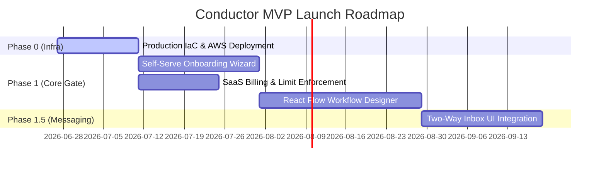

# Conductor — Competitive Roadmap & Implementation Matrix

**Assessment Date:** June 27, 2026  
**Auditor:** Solution Architect + Product Strategist  
**Context Source:** Competitive Intelligence Assessment, Codebase Verification  

---

## 1. Executive Summary: The Reality Gap

An audit of the Conductor codebase reveals a sophisticated event-driven backend monolith architecture that is significantly advanced. However, there is a stark gap between the **completed backend services** and the **missing merchant-facing interface & billing layers** required for commercial launch. 

### Core Product Strengths Verified in Code:
1. **Durable Temporal Workflow Engine:** Fully implemented runtime supporting `WAIT` signals, `DELAY` sleep timers, condition branches, and retry policies.
2. **Built-In Enterprise Connectors:** Native Java-based adapters for **Shopify**, **Zoho CRM**, and **Razorpay** fully implemented with secure AES-256 database-level credential encryption and proxy routing.
3. **Advanced Customer & Compliance Layer:** DPDP India 2023 compliant append-only consent ledger, PII data masking (SHA-256 hashing/AES-256-GCM encryption at rest), and automatic Hibernate row-level tenant isolation.
4. **Production Event Bus & Analytics:** ClickHouse event writers, aggregate KPI calculators, NATS JetStream setup, and Metabase JWT signature token isolation.

---

## 2. Implementation Matrix (Implemented vs. Not Implemented)

Below is a direct comparison of the Competitive Intelligence Assessment features against the actual state of the codebase:

### 2.1 Core Platform & Messaging

| Feature | Assessment Status | Codebase State | Verification & File Reference | Priority for Launch |
| :--- | :--- | :--- | :--- | :--- |
| **Multi-Tenancy** | Planned/Partial | **Implemented** | Gateway-level `X-Tenant-ID` parsing and Hibernate session filter aspects. | Complete |
| **Official Meta Graph API (outbound)** | Implemented | **Implemented** | Wrapper client and template dispatcher. | Complete |
| **Inbound Webhook Verification** | Implemented | **Implemented** | Cryptographic verification and Meta webhook challenge endpoints. | Complete |
| **Consent Management (STOP)** | Implemented | **Implemented** | Append-only `consent_records` block trigger. | Complete |
| **Visual Workflow Designer Canvas** | Planned | **Not Started (UI)** | Web UI contains forms, but no React Flow canvas is implemented. | **High (P0)** |
| **Self-Serve Onboarding Wizard** | Not Started | **Not Started (UI)** | Simple API controller endpoints exist, but the 5-step WABA registration GUI is missing. | **Critical (P0)** |
| **SaaS Billing & Plan Enforcement** | Not Started | **Not Started (Core)** | Razorpay webhook receiver exists, but tenant subscription restrictions are not enforced in filters. | **Critical (P0)** |
| **Two-Way Agent Inbox** | Phase 2 | **Not Started (UI)** | Chatwoot hook registers backend events, but no first-class frontend inbox exists. | **High (P1)** |

### 2.2 Integrations & Intelligence

| Feature | Assessment Status | Codebase State | Verification & File Reference | Priority for Launch |
| :--- | :--- | :--- | :--- | :--- |
| **Shopify Connector** | MVP (P1) | **Implemented** | Order sync, inventory, and webhook ingestion in [ShopifyConnector.java](file:///c:/Users/rajaj/Projects/Conductor/platform/integrations/src/main/java/com/conductor/integrations/connectors/ShopifyConnector.java). | Complete |
| **Razorpay Connector** | MVP | **Implemented** | Payment links, invoices, and refunds in [RazorpayConnector.java](file:///c:/Users/rajaj/Projects/Conductor/platform/integrations/src/main/java/com/conductor/integrations/connectors/RazorpayConnector.java). | Complete |
| **Zoho CRM Connector** | MVP (P1) | **Implemented** | Lead creation, token refresh, and opportunity sync in [ZohoConnector.java](file:///c:/Users/rajaj/Projects/Conductor/platform/integrations/src/main/java/com/conductor/integrations/connectors/ZohoConnector.java). | Complete |
| **Squid Egress Security** | MVP | **Implemented** | Outbound forwarding checks in [ProxyHttpClient.java](file:///c:/Users/rajaj/Projects/Conductor/platform/integrations/src/main/java/com/conductor/integrations/framework/ProxyHttpClient.java). | Complete |
| **Dify NLU / Intent AI** | Phase 2 | **Not Started** | Scheduled for conversational growth phase. | **Medium (P2)** |
| **WhatsApp Catalog Messaging** | Phase 2 | **Not Started** | Requires Meta catalog sync. | **Medium (P2)** |
| **Connector SDK / Marketplace** | Phase 3 | **Not Started** | Requires public REST interfaces. | **Low (P3)** |

### 2.3 Analytics, Operations & Infra

| Feature | Assessment Status | Codebase State | Verification & File Reference | Priority for Launch |
| :--- | :--- | :--- | :--- | :--- |
| **Analytics Dashboard** | Planned | **Implemented** | Micrometer indicators, KPI aggregation, ClickHouse storage, and [MetabaseEmbedService.java](file:///c:/Users/rajaj/Projects/Conductor/platform/analytics/src/main/java/com/conductor/analytics/dashboard/MetabaseEmbedService.java). | Complete |
| **Audit Logs** | Planned | **Implemented** | Write-once database schema and thread context trackers. | Complete |
| **Production Cloud IaC** | Planned | **Not Started** | Terraform scripts and cloud target VPCs are missing (currently uses Docker Compose). | **Critical (P0)** |

---

## 3. High-Priority Launch Backlog

The following table lists the **immediate work packages** required to launch the MVP, prioritized by their business outcome:

### WP-01: Self-Serve Onboarding Portal (PLG Blocker)
*   **Target:** Create the frontend wizard interface enabling merchants to sign up, verify their emails, and connect their WhatsApp number (WABA) using embedded signup.
*   **Dependency:** Tenant and Keycloak administration APIs (Done).
*   **Impact:** Reduces Customer Acquisition Cost (CAC) from ₹15K (assisted onboarding) to <₹5K.

### WP-02: SaaS Billing & Subscription Enforcement (Launch Blocker)
*   **Target:** Bind subscription tiers (Starter, Growth, Business) to platform execution limits. Intercept campaign and workflow launches to verify payment status and quota limits.
*   **Dependency:** Razorpay Billing Connector (Done).
*   **Impact:** Essential for monetization; secures system boundaries.

### WP-03: Visual Workflow Designer (React Flow Canvas)
*   **Target:** Build a graphical UI canvas where merchants can drag-and-drop triggers (Google Calendar, Shopify, Webhook) and bind them to actions (WhatsApp template, Delay, Branch).
*   **Dependency:** Workflow DSL Parser (Done).
*   **Impact:** Simplifies workflow creation for non-technical users.

### WP-04: Two-Way Inbox UI Integration (Chatwoot Bridge)
*   **Target:** Surface the agent dashboard inside the merchant console. Allow human agents to intercept, assign, and respond to incoming WhatsApp queries.
*   **Dependency:** Webhook Ingestion Service (Done).
*   **Impact:** Resolves the biggest competitive objection (inbound messaging capability).

### WP-05: Infrastructure as Code (Terraform)
*   **Target:** Write Terraform configs to spin up the production AWS Fargate cluster, Multi-AZ RDS PostgreSQL database, Redis cache, NATS stream, and Keycloak server.
*   **Dependency:** Local Docker Compose environment (Done).
*   **Impact:** Ensures repeatable, audited environment provisioning.

---

## 4. Competitive Roadmap (Phase 0 — Phase 3)

### Phase 0: Launch Preparation (Weeks 1-4)
*   **Commercial Goal:** Complete billing integrations, secure compliance audits, and deploy to staging.
*   **Features:**
    *   Deploy Production Infrastructure via Terraform.
    *   Implement **Billing Limit Verification Filters** inside the gateway/monolith interceptors.
    *   Develop the **Merchant Onboarding Wizard** UI.
*   **Gate:** Zero-assisted onboarding of a test organization, from signup to payment.

### Phase 1: MVP Healthcare & Services Beachhead (Weeks 5-12)
*   **Commercial Goal:** Acquire 10 paying healthcare tenants, achieve NPS > 40, and recover ₹50K+ in missed appointment costs.
*   **Features:**
    *   Integrate React Flow canvas into UI console.
    *   Activate the **6 Pre-Built Capability Packs** (Appointment reminder, report delivery, Zoho CRM lead sync, Razorpay collection).
    *   Add custom contact attributes and segment search features.
*   **Gate:** 10 paying customers with >80% activation rates.

### Phase 2: Conversational Growth (Months 4-9)
*   **Commercial Goal:** Expand to 100 paying customers, achieve MRR ₹5L, and target e-commerce.
*   **Features:**
    *   **Two-Way Conversations:** Integrate Chatwoot agent inbox as a first-class UI component.
    *   **Dify AI Assistant:** FAQ bots with pgvector knowledge databases.
    *   **Multi-Step Drip Campaigns:** Sequence messages (e.g. abandoned cart recovery).
    *   Shopify product catalogs & payment tracking.
*   **Gate:** 100 active tenants with >110% net revenue retention.

### Phase 3: Platform Ecosystem (Months 10-24)
*   **Commercial Goal:** Platform monetization through commissions, reseller models, and internationalization.
*   **Features:**
    *   Developer SDK and Public REST API.
    *   Third-Party Connector & Capability Pack Marketplace.
    *   Responsive mobile app dashboard.
    *   SMS/Email fallback channels.
*   **Gate:** 500+ active customers, ISV marketplace live.

---

## 5. Summary of Recommended Actions for Raja

1.  **Stop Backend Building:** The backend service layer is completely functional. Do not write additional Java components or adapters.
2.  **Focus on Frontend & Billing Execution:**
    *   Create a clean, responsive merchant frontend UI.
    *   Integrate the onboarding screens, billing dashboard, and flow builder.
3.  **Initiate Staging/Production Deployment:** Write Terraform configurations to deploy the monorepo to AWS Fargate to test under load.
4.  **Engage Healthcare Design Partners:** Sign 3 clinics to test the Google Calendar → WhatsApp reminder loop using the Reference Application and verify the ROI model.
