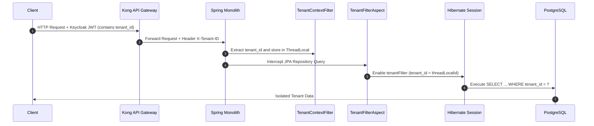

# Conductor Implementation Guide

## A. Purpose
This guide describes the core implementation strategies, runtime frameworks, data isolation patterns, and messaging architectures that power the Conductor platform.

## B. Intended Audience
- Lead Architects
- Senior Backend Engineers (Java/Spring Boot)
- DevOps and SRE Engineers

## C. Scope
Details the logical implementation of multi-tenancy, workflow execution, asynchronous event streaming, and trigger-based audit logging.

## D. Prerequisites
- Deep familiarity with Java 21, Spring Boot 3.x, and Hibernate.
- Conceptual understanding of Temporal Server and NATS JetStream.

---

## E. Detailed Content

### 1. Multi-Tenancy Data Isolation
Conductor enforces a **Logical Shared Database, Row-Level Isolation** multi-tenancy model. Every database table representing tenant-specific data contains a `tenant_id` column of type `UUID`.

#### Flow of Tenant Context Propagation:
1. The client logs in via Keycloak and receives a JWT containing a `tenant_id` claim.
2. The client makes a request to the Kong API Gateway.
3. Kong validates the JWT signature and forwards the request with the `X-Tenant-ID` header downstream.
4. The Spring Boot application processes the request. The class [TenantContextFilter](file:///c:/Users/rajaj/Projects/Conductor/shared/middleware/tenant/src/main/java/com/conductor/shared/middleware/tenant/TenantContextFilter.java) extracts the header and populates [TenantContext](file:///c:/Users/rajaj/Projects/Conductor/shared/middleware/tenant/src/main/java/com/conductor/shared/middleware/tenant/TenantContext.java) (using a `ThreadLocal` variable).
5. A Hibernate Aspect [TenantFilterAspect](file:///c:/Users/rajaj/Projects/Conductor/shared/middleware/tenant/src/main/java/com/conductor/shared/middleware/tenant/TenantFilterAspect.java) intercepts DB queries and automatically enables the Hibernate `@FilterDef("tenantFilter")` binding the query parameters to the `tenant_id` value in the active `TenantContext`.

---

### 2. Workflow Orchestration (Temporal & JSON DSL)
The core capability of Conductor is executing dynamic business workflows configured via a custom JSON DSL.

#### DSL Parsing and Worker Registering:
- **DSL Storage**: Workflow configurations are stored in the `workflow_definitions` database table. A definition maps triggers (e.g., event `order_created`) to a chain of actions (e.g., delay 2 hours, then evaluate a rule condition, then execute HTTP request).
- **Temporal Engine**: Workflows are mapped to Temporal Server. Under [WorkflowWorkerConfig](file:///c:/Users/rajaj/Projects/Conductor/platform/workflow/src/main/java/com/conductor/workflow/temporal/WorkflowWorkerConfig.java), a system worker polls `workflow-system` task queue.
- **Dynamic Workers**: For tenant isolation at the execution layer, [TenantWorkerRegistrar](file:///c:/Users/rajaj/Projects/Conductor/platform/workflow/src/main/java/com/conductor/workflow/temporal/TenantWorkerRegistrar.java) starts dynamic workers listening to queue names formatted as `workflow-{tenantId}`.
- **State Engine**: Workflows run inside [ConductorWorkflowImpl](file:///c:/Users/rajaj/Projects/Conductor/platform/workflow/src/main/java/com/conductor/workflow/temporal/ConductorWorkflowImpl.java), which implements loop steps, delays, and retries. Activities are executed by [ActionExecutor](file:///c:/Users/rajaj/Projects/Conductor/platform/workflow/src/main/java/com/conductor/workflow/service/ActionExecutor.java) (handling HTTP outbound, Meta template sending, database updates).

---

### 3. Asynchronous Messaging (NATS JetStream)
Decoupled communication between the core monolith services and adapters (like the integrations hub) is handled via NATS JetStream.

- **Connection Pool**: Managed by [NatsConnectionManager](file:///c:/Users/rajaj/Projects/Conductor/shared/messaging/src/main/java/com/conductor/shared/messaging/NatsConnectionManager.java), which configures failovers and heartbeat intervals.
- **Publishing Events**: [EventPublisher](file:///c:/Users/rajaj/Projects/Conductor/shared/messaging/src/main/java/com/conductor/shared/messaging/EventPublisher.java) posts standardized events on subjects with format:
  `conductor.{tenantId}.{domain}.{action}`
- **Stream Persistence**: NATS JetStream is configured with file-backed storage to guarantee at-least-once message delivery for downstream consumers.

---

### 4. Database Trigger-Based Audit Ledger
In compliance with DPDP India regulations and security requirements, Conductor tracks all configuration changes at the database row level.

- **Audit Trigger**: Deployed as PostgreSQL functions and triggers. Any `INSERT`, `UPDATE`, or `DELETE` on monitored tables (e.g., `tenants`, `users`, `api_keys`, `consent_records`) automatically executes an database trigger `AFTER` the query completes.
- **Audit Table**: The database trigger writes to the `audit_logs` table, storing the old row data, new row data, executing DB user, context tenant ID, and timestamp as JSONB.
- **Ledger Immutability**: Row updates on the `audit_logs` table are strictly blocked by trigger exceptions.
- **Partitioning**: The `audit_logs` table is physically partitioned by range on the `created_at` field, defaulting to monthly tables (`audit_logs_default`, `audit_logs_y2026m06`, etc.) to simplify data pruning.

---

## F. References
- [Architecture Overview](Architecture-Overview)
- [Data Model Guide](Data-Model-Guide)

## G. Related Wiki Pages
- [Developer & API Guide](Developer-and-API-Guide)
- [Operations Guide](Operations-Guide)
- [Security Guide](Security-Guide)
