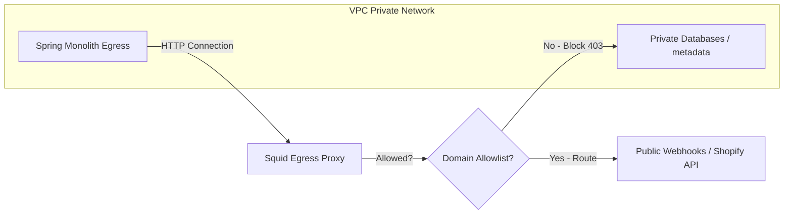

# Integration Guide

## A. Purpose
This integration guide provides implementation specifics for handling inbound third-party webhooks (Shopify, Zoho, Razorpay) and securing egress HTTP connections.

---

## B. Webhook Ingress Layer
All inbound webhooks hit the `:platform:integrations` [WebhookIngressController](file:///c:/Users/rajaj/Projects/Conductor/platform/integrations/src/main/java/com/conductor/integrations/webhooks/WebhookIngressController.java) at path:
`POST /api/v1/integrations/webhooks/ingress/{connectorType}/{tenantId}`

### Inbound Processing Sequence:
1. **Tenant Context Extraction**: The endpoint reads the `tenantId` path parameter and mounts the thread scope context.
2. **Replay Protection**: Check the incoming message header hash (e.g. `X-Shopify-Webhook-Id`) in Redis. If the key exists, return `200 OK` immediately to drop duplicate events.
3. **Cryptographic Validation**:
   - **Shopify**: Recalculates the HMAC SHA-256 hash using the header `X-Shopify-Hmac-SHA256` and the tenant’s registered Shopify secret key.
   - **Razorpay**: Validates the signature header `X-Razorpay-Signature`.
   - **Zoho**: Validates the custom `X-Zoho-Signature` token.
4. **Publish to Event Bus**: Payload values are normalized to a common event schema envelope and posted to NATS JetStream.

---

## C. Outbound Connectors & Credentials
Integrations requiring outbound communication use standard OAuth 2.0 or Api-Key configurations.

- **OAuth Flow**: The tenant admin initiates OAuth authorization code flow. Conductor receives the long-lived refresh token and stores it encrypted.
- **Outbound Execution**: Egress requests are managed by workflow Activities inside the Spring Boot container. A helper retrieves access tokens automatically.

---

## D. SSRF Protection (Egress Proxy)
To protect internal databases and VPC interfaces from malicious endpoints injected by tenants, all egress traffic is routed via a dedicated forward proxy.

- **Squid Proxy Routing**: The integrations module is configured to route traffic through the egress proxy (default port `3128`) using standard Java configuration properties:
  `integration.proxy.enabled=true`
- **Block Categories**: Squid policies drop any connections resolving to link-local IP addresses (`169.254.169.254`), loopbacks (`127.0.0.1`), or subnets inside the local AWS VPC (CIDR block `10.0.0.0/8`).

---

## E. Related Pages
- [Architecture Overview](Architecture-Overview)
- [Developer & API Guide](Developer-and-API-Guide)
- [Security Guide](Security-Guide)
