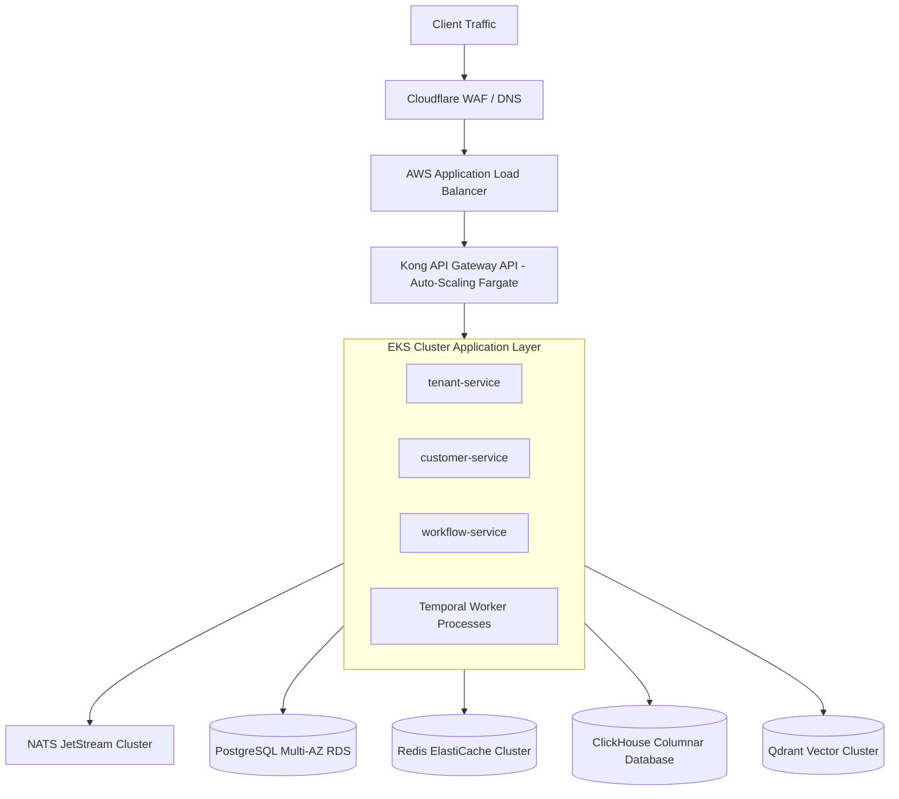

# Conductor Operations Guide

## A. Purpose
This operations guide (runbook) outlines deployment topology, infrastructure provisioning, backup and recovery strategies, SRE maintenance protocols, and disaster recovery procedures for Conductor environments.

## B. Intended Audience
- Site Reliability Engineers (SREs)
- Platform Operators
- DevOps Engineers

## C. Scope
Details cloud deployment architecture, Kubernetes deployments, PostgreSQL and Redis backups, disaster recovery parameters, and scaling strategies.

## D. Prerequisites
- Admin access to target AWS accounts in the Mumbai region (`ap-south-1`).
- Kubernetes cluster control (`kubectl` commands) for targeted environments.
- Read-write database administrative privileges.

---

## E. Detailed Content

### 1. Cloud Deployment Topology
The platform target infrastructure is localized in AWS Mumbai (`ap-south-1`) to comply with Indian DPDP regulations.



---

### 2. Infrastructure Provisioning
Application workloads are managed via Kubernetes configurations inside `/infrastructure/kubernetes` and packaged using Helm charts in `/infrastructure/helm`.

- **Deployment Environments**: Configured folders inside `/environments`:
  - `local`: Developer sandbox environment.
  - `dev` / `qa`: Development and testing spaces.
  - `stage`: Staging environment for release validation checks.
  - `prod`: Production workloads cluster.
- **Service Deployment**:
  To deploy the Spring Boot monolith to production, apply the EKS Helm chart:
  ```bash
  helm upgrade --install conductor-monolith ./infrastructure/helm/conductor-monolith \
    --namespace production \
    -f ./environments/prod/values.yaml
  ```

---

### 3. Backup & Recovery Procedures
To prevent data loss, the data tier runs continuous snapshots and replication policies:

#### PostgreSQL Core:
- **Daily Snapshots**: Automated AWS RDS snapshots scheduled daily at 02:00 IST with a 30-day retention policy.
- **Point-in-Time Recovery (PITR)**: Write-Ahead Logs (WAL) are pushed to S3 every 5 minutes, allowing recovery to any transaction window within the last 14 days.

#### Redis Cache & Session Store:
- Session states are treated as ephemeral, but tenant-rate limiting data is snapshotted every 12 hours to prevent performance spikes during service reboots.

#### Audit Log Rotation:
- The trigger-based `audit_logs` PostgreSQL table partitions are archived. Every month, the past partition (e.g., `audit_logs_y2026m05`) is exported as parquet to secure cold S3 bucket storage and pruned from PostgreSQL.

---

### 4. Disaster Recovery (DR) Parameters
- **Recovery Time Objective (RTO)**: 4 Hours (maximum target window to restore platform access during severe region outage).
- **Recovery Point Objective (RPO)**: 1 Hour (maximum potential data loss window for transactional logs).

#### Region Failover Protocol:
1. DNS endpoints are redirected in Cloudflare from `ap-south-1` primary load balancers to secondary regional active-passive setups (such as Singapore `ap-southeast-1`).
2. Secondary PostgreSQL replicas are promoted to Master role.
3. Temporal workers are scale-booted to drain the task queues.

---

### 5. SRE Maintenance Runbooks

#### Flyway Schema Migrations:
- Migration scripts run on application startup. If a migration fails:
  1. Halt deployment rollout.
  2. Query `flyway_schema_history` table in PostgreSQL to find the failed entry block:
     ```sql
     SELECT * FROM flyway_schema_history WHERE success = false;
     ```
  3. Execute `flyway repair` via Gradle task or manually rollback the database changes.

#### NATS Stream Storage Pruning:
- If NATS JetStream storage usage exceeds 85%, clean historical event logs:
  ```bash
  nats stream purge <stream-name> --force
  ```

---

## F. References
- [System Context](System-Context)
- [Component Catalog](Component-Catalog)

## G. Related Wiki Pages
- [Troubleshooting Guide](Troubleshooting-Guide)
- [Security Guide](Security-Guide)
