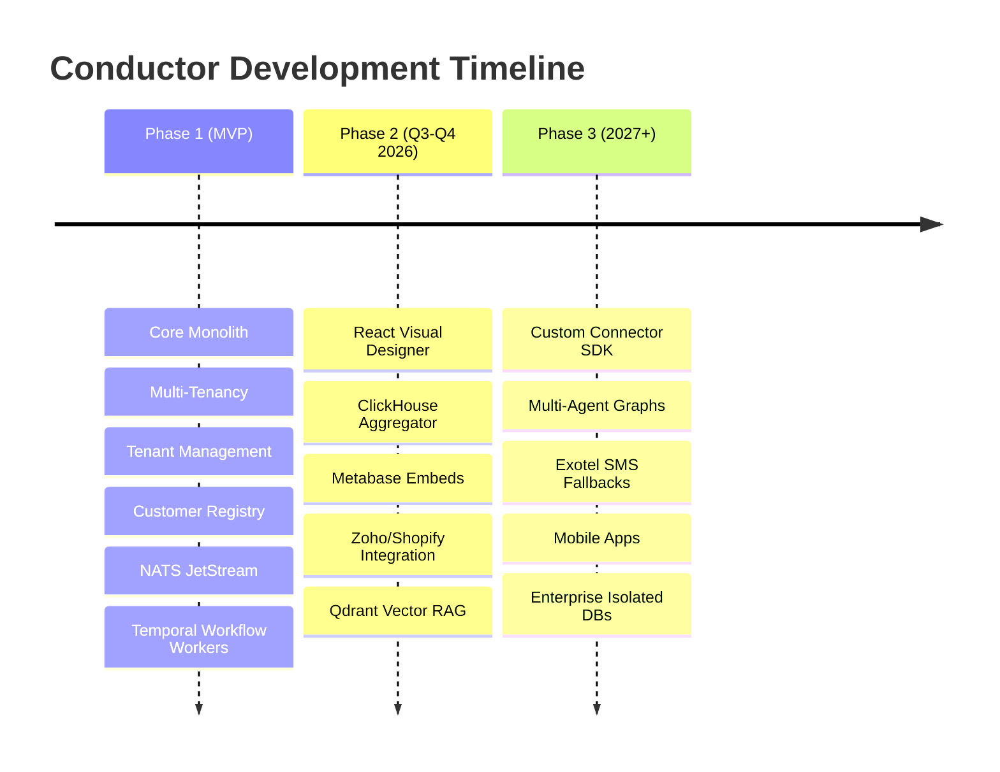

# Conductor Product Guide

## A. Purpose
This guide outlines the product vision, business strategy, user personas, core capabilities, and roadmap for the Conductor platform. It serves to align stakeholders, architects, and developers on the business value and product objectives of the system.

## B. Intended Audience
- Product Managers and Business Analysts
- Executives and Investors
- Software Architects and Engineering Leads
- Onboarding Developers

## C. Scope
Covers the product capabilities of the Conductor MVP and Phase 2 targets, including WhatsApp messaging flows, customer consent, visual workflow design, and external integrations.

## D. Prerequisites
No technical prerequisites. Review of the [Executive Summary](Home) is recommended.

---

## E. Detailed Content

### 1. Product Vision & Strategic Thesis
Conductor is a **Conversational Business Automation Platform** designed for Small and Medium Businesses (SMBs). 

The platform’s strategic thesis is that:
> **200+ distinct business automations can be reduced to approximately 15 reusable platform capabilities orchestrated by a universal workflow execution engine.**

By replacing bespoke ad-hoc code with a visual, config-driven model, Conductor reduces custom integration efforts by 60–70%, utilizing an open-source assembly strategy (Temporal + Chatwoot + Keycloak + NATS + Metabase).

#### WhatsApp-First Strategy
The initial entry point and primary channel is Meta's WhatsApp Cloud API. WhatsApp has higher open rates (>90%) compared to email and SMS in developing markets (such as India, which is Conductor's primary market focus).

---

### 2. User Personas
The platform supports four primary user roles:

| Persona | Role | Primary Goals | Key Interactions |
|---|---|---|---|
| **Business Owner (Tenant Admin)** | The SMB customer purchasing Conductor | Automate business operations, view sales performance, decrease cart abandonment. | Configures workflows, integrates systems (Shopify/Zoho), views Metabase charts. |
| **Business Agent / Staff** | Employees of the SMB customer | Handle client escalations, manage high-touch customer support conversations. | Responds to customers in real time via the shared agent inbox (Chatwoot). |
| **End Customer** | Consumer interacting with the SMB | Receive transaction notifications, schedule bookings, buy products. | Sends and receives WhatsApp messages. |
| **Platform Administrator** | Internal Conductor operations team | Monitor platform health, manage subscription plans, troubleshoot sync failures. | Administers tenant states via Keycloak and the internal admin panel. |

---

### 3. Core Capabilities
The Conductor MVP includes the following capabilities:

#### A. Multi-Tenant Customer Registry
- Acts as a unified source of truth for customer contacts, attributes, preferences, and relationships.
- Resolves identities across channels (e.g. matching an email from Shopify to a WhatsApp number).
- Implements strict cryptographic PII encryption at rest (such as phone numbers and emails) using JPA converters and PostgreSQL columns.

#### B. Campaign & Opt-Out Management
- Orchestrates transactional notification dispatches (e.g., payment reminders, appointment bookings).
- Implements an immutable, database-level consent ledger (`consent_records` table).
- Enforces WhatsApp Business compliance by processing opt-out keywords (e.g., `STOP`, `UNSUBSCRIBE`) and suspending messaging within 5 seconds.

#### C. Visual Workflow Designer
- High-level workflow orchestration defined in JSON DSL.
- Visual designer canvas built using React Flow (Phase 2), letting tenants set delays, decision branches, and egress actions.
- Under the hood, executed as resilient, stateful workflows via the Temporal Java SDK.

#### D. Integration Hub
- Standardized adapters (Connectors) for external webhooks (Shopify, Razorpay, Zoho CRM).
- Normalizes incoming payloads to a uniform event envelope format and publishes them to the NATS JetStream event bus.
- Egress HTTP security routing via a Squid proxy to protect internal subnets from Server-Side Request Forgery (SSRF).

#### E. Embedded Reporting & Analytics
- Provides transactional analysis, campaign click-through rates (CTR), and delivery success metrics.
- Utilizes ClickHouse as a high-performance OLAP database to aggregate system-wide event logs.
- Embeds Metabase dashboards in the frontend React Web App using signed JWT iframes.

---

### 4. Roadmap

---

## F. References
- [System Context](System-Context)
- [Architecture Overview](Architecture-Overview)

## G. Related Wiki Pages
- [User Guide](User-Guide)
- [Developer & API Guide](Developer-and-API-Guide)
