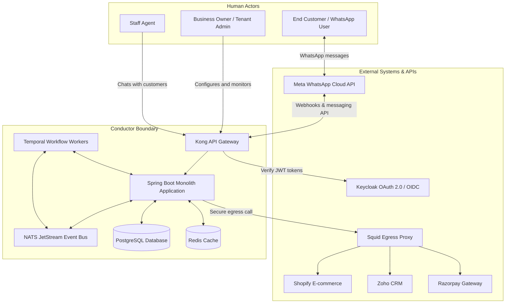

# System Context

## A. Purpose
This page defines the boundaries of the Conductor platform, outlining its actors, external interfaces, and core integration points (equivalent to C4 Level 1).

---

## B. System Context Diagram

---

## C. System Boundary & External Integrations

### 1. Human Actors
- **Business Owner**: Configures settings, manages customer segments, and builds marketing campaigns.
- **Staff Agent**: Responds to end customers via the Chatwoot workspace when support is escalated.
- **End Customer**: Receives notification updates and interacts with the business over WhatsApp.

### 2. External Integration Interfaces
- **Meta WhatsApp Cloud API**: Routes messages via JSON REST payloads (`POST /v18.0/{phone-number-id}/messages`). Receives status callbacks on inbound webhook routes.
- **OIDC Identity Provider (Keycloak)**: Validates logins, returns JSON Web Tokens containing the tenant context, and manages SSO profiles.
- **External Connectors (Shopify, Zoho, Razorpay)**: Dispatches webhooks to Conductor's webhook ingress when events trigger. Integrations route OAuth tokens to read and write CRM data.
- **Squid Forward Proxy**: acts as a gateway for all integrations HTTP egress to block Server-Side Request Forgery (SSRF) to link-local or internal subnets.

---

## D. Related Pages
- [Architecture Overview](Architecture-Overview)
- [Integration Guide](Integration-Guide)
- [Developer & API Guide](Developer-and-API-Guide)
